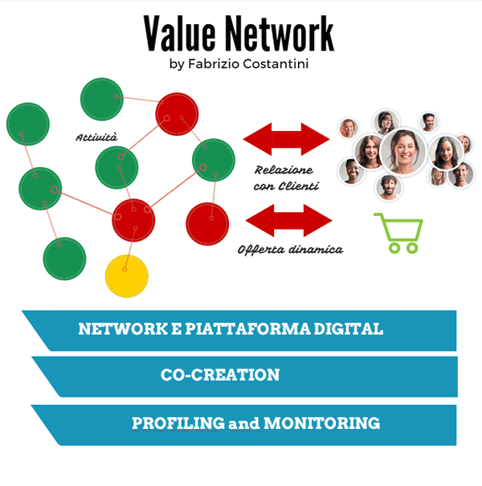
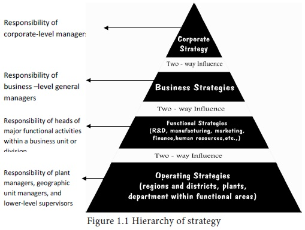
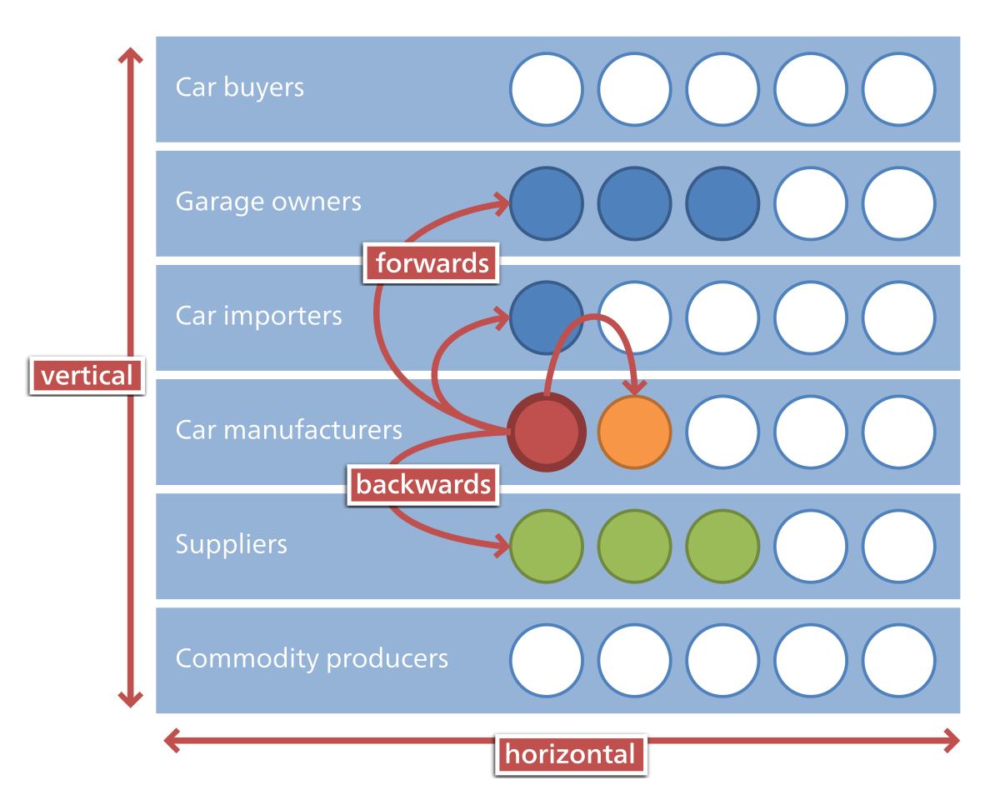
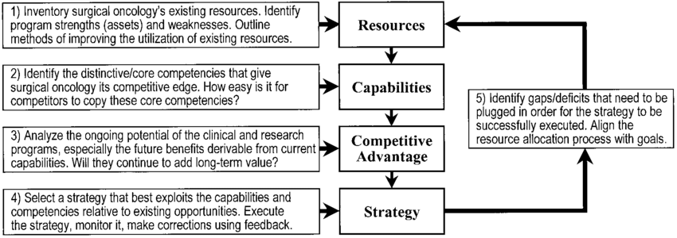
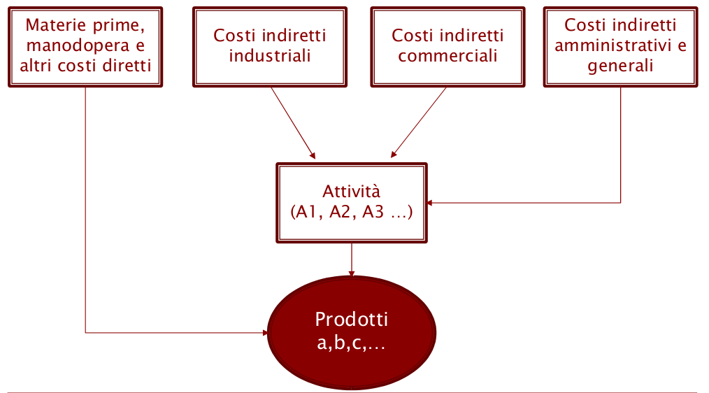
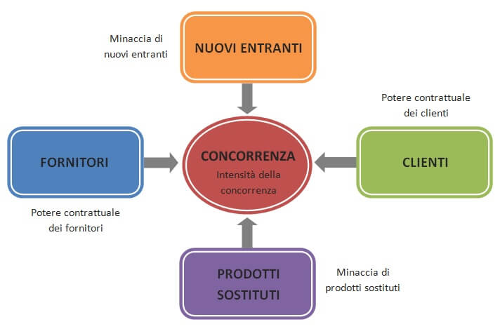
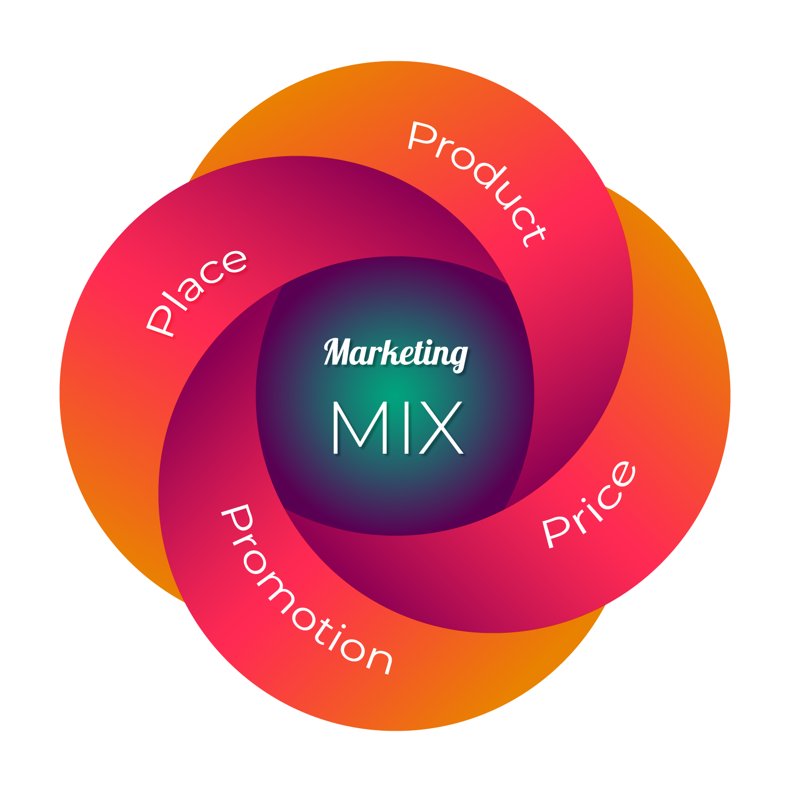
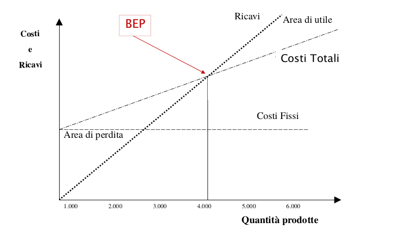

# Net economy

Il concetto di *net economy* è fortemente incentrato sulla digitalizzazione, la net economy è l' **"economia dell'informazione"**. I principali fattori che hanno portato da una tipo di economia tradizionale, basata principalmente sul *principio dei rendimenti decrescenti*, alla net economy, basata sul *principio dei rendimenti crescenti* , sono da ricercare in

* sviluppo e standardizzazione di internet come protocollo di comunicazione digitale.
* interconessione tra oggetti, persone e aziende.

L'utilizzo di internet permette di **ridurre i vincoli spaziali** nei rapporti economici, risultando inoltre un **nuovo canale distributivo** per le aziende. L'impatto di internet nelle attività delle aziende è massimo in quei settori in cui vengono prodotti e distribuiti **beni immateriali** . La capacità di raccogliere, elaborare e trasferire informazioni senza l''utilizzo di supporti fisici trasforma radicalmente i processi produttivi riducendo i costi di distribuzione.

##### Economia Tradizionale vs Net Economy

|                       | Economia Tradizionale           | Net Economy                         |
| --------------------- | ------------------------------- | ----------------------------------- |
| Mercati               | Stabili                         | Dinamici                            |
| Competizione          | Scala locale/nazionale          | Scala internazionale/globale        |
| Fattori di sviluppo   | Capitale, lavoro                | Innovazione e conoscenza            |
| Fattori di progresso  | Meccanizzazione e distribuzione | Informatizzazione                   |
| Vantaggio competitivo | Riduzione dei costi             | Innovazione, qualità e tempestività |

Nell'economia industriale (tradizionale), il **vantaggio competitivo** era detenuto da chi era in grado di **offrire prodotti di maggior qualità al minor costo**.  Poca enfasi veniva posta nei confronti del consumatore e delle sue necessità sopratutto in merito alla **personalizzazione dell'offerta** .

Nell'economia digitale il consumatore e i suoi bisogni assumono un ruolo centrale. La tecnologia permette di ottenere più informazioni riguardo le abitudini dei consumatori permettendo una **microsegmentazione del mercato** e **personalizzazione estrema dell'offerta**, realizzando prodotti di massa personalizzati (il che difficilmente poteva avvenire nell' economia industriale).

### E-commerce

<u>L'insieme dei processi e delle tecnologie con cui avvengono gli scambi commerciali su reti telematiche</u>. Tra le principali attività citiamo: compravendita di beni e servizi, fornitura di contenuti digitali, vendita diretta al consumatore e assistenza post-vendita, trasferimenti elettronici di fondi.

In base ai soggetti coinvolti nella transazione possiamo segmentare il merkato dell'e-commerce in attività:

* **Business-to-consumer (B2C)**: transazioni che intercorrono tra azienda e utente finale.
* **Business-to-business (B2B)**: transazioni che intercorrono esclusivamente tra aziende.

|                 | Vantaggi                                                     | Svantaggi                                                    |
| --------------- | ------------------------------------------------------------ | ------------------------------------------------------------ |
| **Venditori**   | **Riduzione dei costi fissi** (sede fisica e stoccaggio). Focus su  **attività di marketing **. | Ruolo marginale del venditore nel processo decisionale di acquisto. |
| **Consumatori** | **Facilità di acquisto** (tempo, energia, no vincoli orari). **Risparmio**(prezzi di vendita inferiori data la riduzione dei costi fissi) | Feedback diretto nell'acquisto.                              |

# Business Model

> Il  business model di un azienda è un modello che sintetizza, descrive e comunica le modalità con le quali l'azienda realizza la propria vision generando valore per gli stakeholders.

Risulta qui necessario distinguere due concetti correlati ma distinti:

* *Vision*: definisce gli obiettivi di lungo periodo dell'azienda considerando l'evoluzione del contesto operativo in cui essa opera.
* *Mission*: il motivo dell'esistenza dell'azienda sul mercato e l'obiettivo principale. Rappresenta inoltre un elemento distintivo che permette la differenziazione dai competitors.

## Teoria del valore: dalla value chain alla value network

Secondo la teoria del valore la finalità dell'impresa è la **creazione di valore**. Il concetto di valore assume connotazioni differenti:

* **Obiettivo di lungo termine che guida i processi decisionali e le scelte di management.**
* **Misura che rappresenta i risultati ottenuti dall'azienda** in base a varie dimensioni delle sue attività:
  * Economica, finanziaria, patrimoniale
  * Competitiva
  * Sociale
  * Intellettivo

##### Value Chain

Modello proposto da Micheal Porter, vede l'azienda come un processo che genera valore in modo **lineare**: partendo da una serie di input, ogni attività dell'azienda  (divise in *primarie* e di *supporto*) contribuisce alla **generazione del valore**, portando in output il prodotto/servizio da offrire al cliente. 

Durante il processo ogni componente consuma delle risorse (tempo, denaro, materiali, forza lavoro), attraverso il modello è possibile individuare  quali siano le **aree critiche che contribuiscono alla creazione o distruzione del valore**.

##### Value Network

Il modello della value chain pone il focus su costi ed efficienza, mentre **le attività ad alto contenuto informativo sono considerate di supporto**. In un economia digitale/ net economy dove le informazioni assumono un ruolo centrale, il modello proposto da Porter risulta limitato. 

Si passa dunque da un modello lineare ad uno con struttura a rete: la **Value Network**. La rete del valore consiste in un **insieme di agenti economici interconnessi  che co-creano il valore in modo collaborativo e sinergico.** Gli agenti in questione possono rappresentare aziende, clienti, fornitori di contenuti, fornitori di servizi commerciali e fornitori di infrastrutture.

In questo modello è possibile individuare i seguenti concetti chiave:

* **Attività** : sia interne svolte dall'azienda (attività core ed elementari) ma anche quelle esterne svolte da terze parti.
* **Network Logico** : rappresenta tutti gli agenti che offrono le loro competenze per la creazione del valore.
* **Network Fisico** : infrastruttura tecnologica che mette in comunicazione i vari agenti permettendo l'integrazione delle varie attività.
* **Co-creazione** : il valore viene creato sia internamente dall'azienda ma anche dagli attori esterni che diventano partner nella creazione di valore.
* **Profilazione e monitorazione**: le relazioni con i clienti sono uno dei fattori critici di successo. La capacità di segmentazione dei mercati, profilazione, monitorazione dell'esigenze ed esperienze dei clienti diventano attività fondamentali.

I modelli di business in un economia digitale sono sostanzialmente diversi da quelli adottati in un  contesto di economia tradizionale. I modelli di business digitali devono essere concepiti considerando non solo l'azienda ma anche le **reti di valore** all'interno delle quali essa si colloca.

Le aziende net based sono consapevoli del fatto che il vantaggio competitivo è molto meno difendibile rispetto al passato a causa della **potenziale concorrenza globale** e **rapido sviluppo tecnologico**, per mantenere il vantaggio competitivo e sopravvivere nel mercato si necessita di un **costante miglioramento e innovazione** con la capacità di **adattamento ai cambiamenti esogeni**.

## Fattori Critici di Successo

I Fattori Critici di Successo (FCS) consistono in un numero limitati di **aspetti gestionali** o “variabili" sulle quali il management può agire con le sue decisioni e che **possono incidere in modo consistente** (in negativo o positivo) sul **vantaggio competitivo** delle varie imprese del settore. Per un impresa net based gli FCS sono da ricercare principalmente in: 

* **Scalability del business model**:  il modello di business deve tener conto dell'abilità dell'azienda di far fronte ad na crescita della domanda di mercato, mantendeno i margini di profitto all'aumentare dei volumi di vendita.

* **Solution Branding** : il brand diventa per gli utenti l'insieme di aspettative rispetto ad un prodotto/servizio. Le attività di branding non devono essere orientate al prodotto ma guidate da un analisi delle esigenze degli utenti.

* **Vantaggio del first mover**: il vantaggio competitivo che un azienda accumula nei confronti dei competitors muovendosi prima nell'esercizio di una determinata attività. Un azienda first mover rafforza il suo brand sviluppando barriere all'entrata nei confronti dei potenziali competitors.

* **Value Bundling**: le imprese che oltre il core business aggiungono prodotti e servizi al proprio bundle hanno maggiori probabilità di successo.

  

# Strategie d'impresa

> Per strategia d'impresa s'intende un processo nel quale vengono pianificate decisioni commerciali, operative e finanziare considerando l'ambiente operativo e le risorse disponibili, al fine di raggiungere gli obbiettivi prefissati.

L'obiettivo principale della strategia consiste nella **creazione di valore** per gli stakeholders. Nella definizione di una strategia bisogna sempre considerare: la definizione degli obiettivi di **lungo periodo**, delle  nella **gestione** e nell' acquisizione e allocazione di risorse.

In prima analisi è utile differenziare le strategie in base al livello di business considerato:

> più alto andiamo più le azioni sono influenti sui livelli inferiori maggiore è l'orizzonte 

* **Livello Corporate**: strategia eleborata dai top manager per l'intera organizzazione. In una strategia corporate viene definito in quali business l'azienda vuole competere, quale **orientamento** dare alle strategie, quale struttura organizzativa deve assumere l'azienda. => *"Dove avviene la competizione?"*

* **Livello Business**: strategie rigurdanti le singole *Strategic Business Unit (SBU)* . Una SBU è la parte dell'organizzazione dotata di una **propria mission, mercato e competitors** e dunque di una propria strategia. In questo livello le stragie definiscono quali **vantaggi competitivi** costruire e come mantenerli, quali prodotti e servizi sviluppare e con quali criteri allocare le risorse. => *"Come avviene la competizione?"*
* **Livello Funzionale**: strategie rigurdanti le attività funzionali che compongono l'organizzazione aziendale. A differenza del livello superiore, questo tipo di strategie ha un raggio di azione più limitato sia rispetto all'orizzonte temporale che all'impatto sull'intera organizzazione.

Le strategia a livello corporate possono essere classificate in

* Strategie di **sviluppo**: concentrazione, diversificazione e internazionalizzazione.

* Strategie di **stabilità**: l'azienda **persegue la propria mission** e gli obiettivi senza un significativo cambio di strategie.
* Strategie di **contrazione**: l'azienda **riduce il suo campo d'azione**.

## Strategie di crescita 

#### Concentrazione

In una strategia di concentrazione l'azienda sceglie di concentrare le proprio risorse. 

Due differenti tipologie:

* **Integrazione Verticale** : l'azienda decide di espandersi lungo la filiera produttiva (*supply chain*) **internalizzando** le varie attività della filiera diverse da quelle svolte in origine. L'integrazione verticale permette all'azienda di rimanere nel settore di origine avendo **maggiore controllo sul ciclo produttivo**.

  I principali motivi che spingono ad un integrazione verticale sono la **saturazione del mercato**, la forte **specializzazione di risorse** umane e tecniche del settore e quando l'azienda si trova in presenza di un **forte potere di mercato dei fornitori** (pochi fornitori che impongo prezzi di acquisto alti) e quindi risulterebbe più conveniente produrre internamente. Tra le modalità più frequenti per realizzare forme di  integrazione verticale sicuramente citiamo **l'acquisto di un impresa** che già realizza una o più attività della filiera se questo conviene meno risorse economiche rispetto allo **sviluppo interno**.

  * | Vantaggi                                                     | Svantaggi                                                    |
    | :----------------------------------------------------------- | ------------------------------------------------------------ |
    | **Maggiore controllo** sulla filiera produttiva => si stabilizzando prezzi e qualità | Incremento della **complessità organizzativa**               |
    | Rafforzamento del **potere contrattuale** rispetto ai fornitori e clienti | Perdita di dinamicità rispetto alle **innovazioni tecnologiche** e difficoltà a prevedere la domanda |
    | **Stabilizzazione dei mercati** e dei volumi di produzione   |                                                              |

  > es. amazon nasce come piattaforma di ecommerce ma per ottenere la qualità del servizio desiderato integra verticalmente la logistica e la delivery con amazon logistics

* **Integrazione Orizzontale**: diametralmente opposta a quella verticale, prevede l'espansione dell'azienda nello **stesso stadio della filiera produttiva**. L'integrazione orizzontale favorisce l'espansione delle proprie attività in **<u>differenti aree geografiche e differenti mercati</u>** ottenendo **economie di scala**. Similmente all'integrazione verticale, anche in quella orizzontale, si ha u**n incremento della complessità organizzativa aziendale,** inoltre porta a **situazioni di monopoli**o di un determinato settore con interesse (negativo) da parte di organi governativi come l'antitrust.

  > acquisto di instagram e facebook

#### Diversificazione

Strategia di svluppo incentrata sull'acquisto di aziende che operano in **settori non correlati** rispetto a quelli di partenza. Al fine di attuare una strategia di diversificazione bisogna considerare il **potenziale di sviluppo** e **l'attrattività** dei settori in cui opera la nuova impresa senza sottovalutare l'incremento di risorse di management per le nuove attività.

Una strategia di diversificazione può realizzarsi principalmente in due modalità

* **Diversificazione Concentrica**: la diversificazione si articola attorno un **nucleo centrale** che costituisce un vantaggio rispetto ai competitors e attorno al quale si forma un indotto di attività complementari. Tale nucleo può essere rappresentato dalla **tecnologia dei processi produttivi** , **capacità organizzativa**, **rete di distribuzione**, **base di clienti**, **presenza in molteplici mercati**.

  > ws. dececco sughi e oli, 

* **Diversificazione Conglomerata**: si riuniscono imprese i cui prodott/servizi non sono in concorrenza tra loro e che appartengono a **settori completamenti non correlati**, l'unico legame tra le imprese è quello di far capo ad un unica ***holding*** che controlla il capitale investito.

  Tra le principali ragioni che spingono ad attuare una strategia di questo tipo citiamo:

  * la possibilità di affiancare imprese che hanno una forte disponibilità liquida ad imprese con bassa disponibilità ma alto potenziale.
  * compensazione di andamenti ciclici opposti di imprese differenti.
  * espansione in nuovi settori per ottenere maggiore redditività e potenziale sviluppo.
  
  > la holding samsung con samsung electronics e samsung heavy industries

## Fusioni ed Acquisizioni

Nella sezione precedente si è visto come le differenti strategie di sviluppo (vedi integrazione verticale o diversificazione conglomerata) solitamente prevedono l'acquisto di altre imprese. Solitamente si ricorre all'acquisto di altre imprese principalmente per:

* **Barriere all'ingresso in nuovo mercato** (controllo su fattori strategici, brevetti, licenze, marchi, customer loyalty)
* **L'acquisto richiede meno risorse rispetto allo sviluppo interno** di prodotti/servzi o rete di distribuzione

In un economia tradizione, le fusioni e le acquisizioni (M&A), erano la naturale conseguenza dei processi di consolidamento settoriale da parte dell'impresa. Con la net economy, le operazioni di M&A, sono il risultato d**i strategie di espansione dei mercati**, **completamento della catena del valore** nelle core activity e sfruttamento di sinergie (1+1 > 2).

Le operazioni di M&A portano alla creazione di *multinazionali*, imprese che controllano molteplici unità operative in differenti aree geografiche le cui strategie delle singole unità vengono ricondotte ad una comune strategia generale.

## Gestione del Business

In questa sezione verranno analizzati due modelli basati sulle *matrici di portafoglio*, utilizzati nelle strategie a livello di business.

##### Matrice BCG (Boston Consulting Group):

Modello nel quale si classificano le SBU in 4 categorie differenti, considerando due dimensioni: 

* **Tasso di crescita** del mercato (asse verticale) 
*  **Quota di mercato relativa** (asse orizzontale) .

Le 4 categorie di SBU sono:

* ***Stars***: SBU con posizione **competitiva alta e mercato in forte sviluppo.** Sono le SBU con maggiori **prospettive di profitto** e opportunità di sviluppo ma **necessitano di ingenti investimenti.**
* ***Question marks*** : SBU p**osizione competitiva debole ma in un mercato in forte sviluppo**. Necessitano di molta liquidità per ottenere la **leadership del mercato**.
* ***Cash Cows***: SBU con **posizione competitiva forte in un mercato con basso ritmo di sviluppo**. Sono in grado di **generare liquidità** e profitti da investire nelle SBU stars e necessitano di investimenti ridotti.
* ***Dogs*** : SBU con **posizione competitiva debole in un mercato con basso ritmo di sviluppo**. Non conviene investire data la mancanza di profitti futuri e prospettive di crescita.

##### Matrice McKinsey

A differenza della matrice BCG offre una visione più granulare delle strategie d'impresa e viene costruita su due dimensioni **posizione competititva** (quota di mercato relativa, reputazione, margini di profitto rispetto ai comeptitors, reputazione e immagine dell'impresa) e **attratività del settore** (dimensioni, tasso di crescita, redditività, grado di rischio e incertezza del mercato), variabili aggregate che sintetizzano diversi fattori.

# Vantaggi Competitivi

Con vantaggio competitivo s'intende tutto ciò che ad un impresa gli permette di avere una **redditività superiore alla media del settore**. 

Il concetto di redditività può essere quantificato da molteplici punti di vista attraverso l'utilizzo di diversi indici:

**Return On Asset (ROA):**
$$
\frac{\text{Margine Operativo Netto (MON)}}{\text{Totale Impieghi}}
$$

**Return On Sales (ROS):**
$$
\frac{\text{Margine Operativo Netto (MON)}}{\text{Ricavi}}
$$

**Return On Equity (ROE):**
$$
\frac{\text{Utile di esercizio}}{\text{Patrimonio Netto}}
$$

O in termini più qualitativi attraverso la **quota di mercato**, **customer satisfaction**, **customer loyalty**. Nella definizione di vantaggio competitivo intervengono i seguenti elementi:

* **Beneficio Percepito** (B): **somma dei benefici percepiti** dall'acquisto di un prodotto/servizio da parte di un cliente al netto dei costi di transazione (escluso il prezzo) e costi di installazione, esercizio o manutenzione.
* **Consumer Surplus**: differenza tra beneficio percepito e il suo prezzo monetario (P).
*  **Valore creato dall'impresa**: differenza tra beneficio percepito e costo del prodotto (C).

## Le fonti del vantaggio competitivo

Il vantaggio competitivo è influenzato da **cambiamenti *endogeni***, ovvero interni all'impresa', e dalla capacità dell'impresa di reagire e anticipare i **cambiamenti *esogeni***, esterni alla stessa. Analizziamo dunque quali sono le fonti che determinano il vantaggio competitivo di un impresa. 

Due framework di analisi principali:

* **Approccio Strutturale**: si basa sull'analisi della **posizione nel settore** dell'impresa rispetto ai competitors. Le fonti di vantaggio competitivo sono da ricercare principalmente in  **fattori esogeni**
* **Resource Based Theory**:  Pone il focus sulle **risorse interne** dell'impresa e sulla loro **importanza** in termini di **costruzione di vantaggio competitivo sostenibile**. Le fonti di vantaggio competitivo sono da ricercare principalmente in  **fattori endogeni**

##### Approccio Strutturale

Secondo l'approccio strutturale il vantaggio competitivo può essere costruito seguendo 3 strategie generiche:

* **Leadership di costo**:  la capacità dell'impresa di produrre prodotti/servizi simili o equivalenti rispetto a quelli dei competitors ad un **costo minore**. Al fine di minimizzare il costo di produzione l'azienda può **migliorare il processo produttivo**: migliore efficienza d'uso degli impianti e attrezzature, contenimento dei costi delle funzioni aziendali, minimizzazione dei costi minimi. Tale vantaggio competitivo è **"product-driven"** e si manifesta principalmente nei **confronti dei competitors.**
* **Differenziazione**: la capacità dell'impresa di produrre prodotti/servizi con **caratteristiche uniche** per il cliente che vengono percepiti superiori rispetto all'offerta della concorrenza.  La differenziazione può avvenire attraverso: il design, il brand, il servizio al clienti o la rete di distribuzione. Tale vantaggio competitivo è **"market-driven"** ed è **orientato principalmente al cliente.**

* **Focalizzazione**: l'impresa **concentra l'offerta** su uno o più segmenti di mercato invece che l'intero settore. La focalizzazione può avvenire a livello geografico, demografico o comportamentale. Tale strategia è **ortogonale** rispetto alle due precedenti, avendo dunque strategie di focalizzazione orientate al costo e alla differenziazione.

L'approccio strutturale risulta una **notevole semplificazione** della realtà, spesso le due strategie di leadership di costo e di differenziazione **non sono mutuamente esclusive** ma le imprese tendono a **perseguirle entrambe**.

##### Resource Based Theory

Questo framework individua il vantaggio competitivo nei **fattori endogeni** dell'impresa quali:

* **Risorse**: fattori produttivi, risorse umane, tecnologiche, finanziare e organizzative. 
  * **Le risorse *tangibili***: sono quelle che più si prestano ad essere imitate e direttamente confrontabili tra i competitors e sono: le economie di scala e scopo, i costi di pubblicità e promozione, la copertura geografica della rete distributiva, il costo delle materie prime, ecc... 
  * **Le risorse *intangibili***: sono più difficili da imitare in quanto in quanto **rare e complesse** da ottenere: conoscenza, capacità di innovazione, l'accesso alle informazione, la cultura aziendale, il brand, la customer loyalty, know-how di processi (produttivi, di gestione, tecnologici).
* **Capacità**: le capacità organizzative sono le capacità di **reperire** risorse, **aggregarle** e **coordinarle** nei processi produttivi  in modo superiori rispetto ai competitors.
* **Competenze distintive**:  **risorse + capacità**, ciò che l'impresa non ha in comune con i suoi competitirs.

La Resource-based theory afferma che le **risorse di valore, rare e difficili da imitare e sostituire, sono quelle che su cui può essere costruito un vantaggio competitivo sostenibile** in quanto risultano risorse strategiche. Al fine di risultare utili per la costruzione del vantaggio competitivo si richiede che le risorse presentino le seguenti caratteristiche:

* **Durabilità**: l'arco di vita di una risorsa dipenda dalla natura della stessa (es. risorsa tecnologica vs risorsa umana o il brand di un'impresa). Le capacità hanno una durabilità maggiore rispetto alle risorse in quanto è possibile mantenere le capacità internamente all'azienda sostituendo le risorse esaurite.
* **Trasparenza**: la capacità di mantenere il vantaggio competitivo dipende anche dalla velocità con cui i competitors riescono ad **imitare** le strategie dell'impresa. La difficoltà di imitazione è direttamente proporzionale alla complessità del sistema di risorse utilizzate dall'impresa da copiare.
* **Trasferibilità**: l'imitazione di una strategia prevede l'acquisizione delle risorse e lo sviluppo delle competenze su cui tale strategia è fondata. Maggiore è la trasferibilità di tali risorse minore sarà la durata del vantaggio competitivo acquisito.
* **Riproducibilità**: la capacità di sviluppare internamente le risorse e le capacità utilizzate in una strategia rivale.

Analisi nel framowork RBT: 

## Elementi del vantaggio competitivo

* efficienza: produttività in termini monetari, economie di sclaa
* qualità: se riesce a soddisfare il più possibile le esigenze del consumatore
* innovazione: incrementale o radicali che modificano le dinamiche di comepetizione. RIdurre *time to market*
* capacità di risposta ai clienti

# Comunicazione d'Impresa

La comunicazione d'impresa prevede una moltitudine di soggetti e aspetti coinvolti. Una prima categorizzazione della comunicazione d'impresa può essere effettuata considerando le diverse categorie di soggetti coinvolti:

| Tipologia                 | Soggetti                                                     | Oggetto della comunicazione                                  |
| ------------------------- | ------------------------------------------------------------ | ------------------------------------------------------------ |
| **Commerciale**           | soggetti esterni all'impresa quali i clienti                 | prodotto, servizio, brand                                    |
| **Economico-Finanziaria** | finanziatori, investitori e portatori di capitale            | situazione reddituale, patrimoniale e finanziare dell'impresa. |
| **Istituzionale**         | organismi pubblici, istituzioni e rappresentanze sociali     | ruolo dell'azienda nella comunità di appartenenza.           |
| **Interna**               | soggetti interni all'impresa quali i dipendenti, dirigenti e collaboratori | le attività, i processi, gli obiettivi dell'impresa.         |

Tra i principali strumenti di comunicazione citiamo :

* **Pubblicità**: comunicazione tra azienda ed un vasto pubblico non selezionato.
* **Promozione**: azioni finalizzate a  stimolare il cliente all'acquisto . Si realizzano spesso attraverso campagne promozionali di periodo limitato facendo leva sul prezzo.
* **Relazioni pubbliche**: iniziative come convegni, seminari, presentazioni, sponsorizzazioni finalizzate a stimolare una reputazione positiva dell'impresa.
* **Propaganda**: insieme eterogeneo di iniziate volte a rafforzare la notorietà del prodotto
* **Marketing diretto**: comunicazione tra azienda e singoli clienti  

##### Internet e Comunicazione

Internet diventa un nuovo mezzo di comunicazione che modifica i tradizionali modelli di comunicazione.

Si passa da un modello **one to many** della comunicazione di massa, in cui l'utente ha un **ruolo passivo** nella costruzione dei contenuti, alla possibilità simultanea  di due modelli **one to one** e **many to many**. Con Internet, gli utenti hanno un **ruolo attivo** avendo modo di **condividere** e **interagire** con i contenuti.

La costruzione di un sito web permette di collezionare molte informazioni, sia qualitative che metriche quantitative utili per formulare strategie di marketing. Attraverso l'utilizzo di differenti forme di acquisizione dell'informazione (form, questionari, email, navigazione sul sito, click stream analysis, sentiment analysis) è possibile analizzare il **customer behaviour** ed effettuare segmentazioni di mercato.

Tra le principali attività di comunicazione agevolate da Internet, citiamo il **direct marketing**: un strategia di comunicazione d'impresa rivolta ai **singoli clienti** accuratamente **selezionati** con lo scopo di ottenere una risposta da parte dei clienti **diretta, immediata e misurabile**. In questo modo l'azienda riesce ad ottenere un maggiore livello di **personalizzazione dell'offerta** riuscendo ad  anticipare le esigenze del cliente.

Il direct marketing si articola in 4 fasi principali:

1. Identificazione del target
2. Selezione dei media: radio, tv, stampa, internet, newsletter, eventi, ecc.
3. Definizione dell'offerta al fine di generare risposte e avviare un processo di fidelizzazione del cliente.

# Organizzazione Aziendale: 

##### Dalla collaborazione alla cooperazione

Il ruolo dell'innovazione dei processi aziendali assume un importanza strategica nella creazione del vantaggio competitivo. La capacità di innovazione deriva dall'attitudine dell'impresa alla **collaborazione**. Un trasferimento collaborativo di informazioni si verifica quando lo **scambio di conoscenza** (*esplicita* o *implicita*) avviene di  sulla base di 3 elementi:

* di **comune accordo**.

*  con uno **scopo comune**.
* in vista di **reciproci benefici**.

> La rete di imprese consente ai partecipanti di mettere in comune attività e risorse per migliorare il funzionamento aziendale e rafforzare il vantaggio competitivo.

A metà strada tra collaborazione e competizione troviamo la **cooperazione**, se la cooperazione avviene tra competitors allora si parla di **coopetizione**. Le relazioni dei rapporti di scambio modificano quelle pre-esistenti o creano nuove forme organizzative d'impresa:

* **strutture organizzative esterne**: su scala  inter-aziendale si vieen a formare un nuovo tipo di organizzazione: il  **network di imprese**. Il funzionamento della rete si fonda su un **principio di complementarietà** tra
  * **capacità interne** dell'impresa: fungono da moneta di scambio rappresentando le capacità dell'impresa di **contribuire**  e **beneficiare** alla cooperazione .
  * **collaborazione esterna**

* **strutture organizzative interne** : si passa da modelli prettamente **gerarchico-piramidali** a modelli **iperarchici**, dove ogni membro è **libero di comunicare** con chiunque altro eliminano la necessità di intemediari. => "flatten the hierarchy" **mantendo i ruoli** degli individui

## Rete di imprese

##### Fattori di Sviluppo

Una volta definiti gli elementi che caratterizzano il network di imprese, analizziamo ora quali sono i principali fattori che portano alla nascita e sviluppo di un organizzazione reticolare:

* **Incertezza della domanda**: domanda stabile con offerta incerta porta le imprese ad attuare strategie di *integrazione verticale*. In condizioni di incertezza di domanda le imprese cercano di aumentare la flessibilità organizzativa ricorrendo all'**outsourcing**.
* **Complessità delle attività**: la quantità di input per la produzione di un prodotto o l'erogazione di un servizio crea interdipendenza tra le attività favorendone il coordinamento.
* **Alta frequenza degli scambi**

In una  rete in cui <u>unità autonome interdipendenti che svolgono compiti complessi in presenza di domanda incerta</u>, il maggiore problema è la **coordinazione**. Piuttosto che affidare il controllo e la coordinazione ad *autorità* e *fonti di legittimazione legale* la rete si affida a **meccanismi sociali** **autoregolativi** quali:

* **Restrizione all'accesso**: riducendo il numero di partner negli scambi della rete si riducono inevitabilmente i costi della coordinazione. Inoltre aumentano  le interazioni tra i partners **consolidandosi** e permettendo lo sviluppo di *routine organizzative*.
* **Macrocultura**: uni sistema di valori condivisi da  luogo a **schemi di comportamento comuni** che favoriscono le attività di coordinazione. Gli eventi di settore, le riviste specializzate e la socializzazione tra gli appartenti agli ordini professionali sono fattori che permettono l'omogenizzazione, standardizzazione e la condivisione delle informazioni, comportamenti  e dei valori culturali.
* **Sanzioni Collettive**: punizione dei membri che violino le **norme e i valori del gruppo**. Questo meccanismo è essenziale in quanto definisce i **parametri di accettabilità** dei comportamenti dimostrando le **conseguenze** della violazione.
* **Reputazione**: al crescere dell'**incertezza** ambientale, le imprese della rete attribuiscono sempre maggiore importanza alla propria reputazione e quella dei partners. La reputazione riduce l'incertezza poiché **fornisce informazioni** sulla controparte dissuadendo da **comportamenti ingannevoli** principale freno degli scambi.

##### Tipologie della rete

A livello strutturale la rete di imprese può essere analizzata da differenti prospettive, ne riportiamo le principali:

* **Centralizzazione della rete**: descrive la **distribuzione delle risorse** condivise tra le imprese della rete. Indica il **grado di coinvolgimento** di un impresa nella rete. (in degree/centrality)
* **Interattività delle relazioni cooperative** : descrive la propensione ad **integrare le risorse** possedute all'interno della rete. (out degree)
* **Apertura dei blocchi strategici**: individua se sono presenti relazione cooperative **intra-blocco strategico e tra imprese di blocchi differenti** => le imprese di uno stesso blocco cooperano solo tra di loro o anche all'esterno? . Il grado di apertura è direttamente proporzionale al livello di incertezza della rete, in quanto le imprese sono spinte a ricerca nuove opportunità quindi ampliare le loro relazioni.
* **Densità dei blocchi strategici**: **distribuzioni delle relazioni cooperative all'interno del blocco**. La densità del blocco è indicatore della connessione e del coinvolgimento delle imprese all'interno del blocco.

> un blocco strategico è un insieme di imprese più densamente connesse rispetto ad altre (network community) 

In base alle caratteristiche strutturali presentate è possibile individuare 4 tipologie principali di reti:

| Nome             | Caratteristiche Strutturali                                  | Settore Tipico                                      |
| ---------------- | ------------------------------------------------------------ | --------------------------------------------------- |
| Reti Frammentate | assenza di leadership di mercato e relazioni cooperative con forte instabilità | IT                                                  |
| Reti Complesse   | Gerarchia tra blocchi, relazioni altamente interattive, molteplici percorsi relazionali | Biotecnologie (relazioni con più centri di ricerca) |
| Reti di Filiera  | Blocchi con bassissima apertura, rapporti stabili e di lungo termine | Automotive                                          |
| Reti Orizzontali | Centralizzata, densa, chiusa, a bassa intensità relazionale  |                                                     |

## Imprese Virtuali

La struttura reticolare si ripercuote anche sull'organizzazione aziendale **interna**. La nuova impresa risulta essere :

* **Frattale**: l'organizzazione interna è strutturata a rete.
* **Virtuale:** i soggetti interni si articolano in **team virtuali,** ridefinendosi in base alle condizioni di mercato. Un organizzazione virtuale tende a rendere **permeabili le barriere** tra livelli e funzioni organizzative al fine di rendere più **dinamico e flessibile il trasferimento** di informazioni, idee, competenze e decisioni. Le barriere possono essere: *verticali*, barriere tra gradi e livelli; *orizzontali*, barriere tra funzioni e discipline; *esterne*, barriere tra impresa e fornitori/clienti; *geografiche*, barriere tra aree geografiche, culturali e mercati.

* Basata su **teamworking**: gruppi di lavoro strutturati a rete con una struttura temporanea predisposti a **cambiamenti adattivi**. Il team è spesso composto da **individui eterogenei** e distribuiti geograficamente ma che **condividono interessi e obiettivi comuni**. 

  La predisposizione al cambiamento e la **volatilità** potrebbe risultare anche un potenziale problema in quanto non vengono a crearsi tra i membri quelle **relazioni sociali** utili ad ottenere un **alto commitment**.

  Affinché si crei un buon team si necessità la definizione di una **vision condivisa** e un ottimo livello di **comunicazione** supportato da una infrastruttura tecnologica.# Contabilità Generale
La contabilità generale è un sistema finalizzato alla rilevazione contabile degli aspetti gestionali:

* **Economici**: variazioni di ricchezza determinate da **realizzazione di ricavi** e **insorgere di costi**
* **Finanziari**: **entate e uscite** di denaro e **variazioni di crediti e debiti**

##### Il bilancio

* Cos'è? => insiemi di documenti finalizzati alla **rappresentazione veritiera e corretta degli aspetti economici-finanziari-patrimoniali derivanti da operazioni aziendali.**
* Finalità? => Rappresenta uno strumento di **controllo della gestione aziendale** e **comunicazione economico-finanziaria** verso gli stakeholders.

| Tipologia                         | Soggetti a cui è rivolto                  |
| --------------------------------- | ----------------------------------------- |
| Bilancio Civilistico              | Esterni (stakeholders e analisti)         |
| Bilancio Fiscale (normative TUIR) | Fisco                                     |
| Bilancio Interno                  | Interni (analisti interni, manager, soci) |

## Bilancio (Civilistico)

Lo strumento principale è il **bilancio**, un insieme di documenti articolati in:

* Stato Patrimoniale: attivo e passivo. Le voci nell'attivo vengonoclassificate in base al **criterio di destinazion eeconomica**, mentre il **passivo** per natura (tipologia del soggetto debitore)
* Conto Economico
* Nota Integrativa: documento che fornisce un commento esplicativo dei dati rappresentati nello stato patrimoniale e conto economico.

> Il bilancio viene redatto secondo la **IV direttiva CEE** che stabilisce la struttura dei documenti indicandone macroclassi, classi, voci e sottovoci.

### Stato Patrimoniale

Lo stato patrimoniale può essere considerato un **inventario complessivo di beni e diritti** vantati su questi beni. I beni sono considerati la parte dell'**attivo**, i diritti la parte del **passivo**.

| Attivo (criterio di destinazione economica) | Passivo (criterio per natura)   |
| ------------------------------------------- | ------------------------------- |
| A) Crediti vs. soci non ancora versati      | A) Patrimonio Netto             |
| B) Immobilizzazioni                         | B) Fondo per Rischi e Oneri     |
| C) Attivo Circolante                        | C) Trattamento di Fine Rapporto |
| D) Ratei e Risconti                         | D) Debiti                       |
|                                             | E) Ratei e Risconti             |

##### Attivo

* **A) Crediti vs soci per versamenti ancora dovuti**: crediti che l'azienda vanta verso i soci ma **non ancora incassati**. (es. sottoscrizione di una quota di capitale sociale non ancora versato dal socio)
* **B) Immobilizzazioni**: beni strumenti utili nella produzione destinati ad un **utilizzo durevole**. Sono divisi in
  * **I) Imm. Immateriali**: beni con natura intangibile (es. brevetti, licenze, software)
  * **II) Imm. Materiali**: beni con natura tangibile (es fabbricati, terreni, impianti industriali)
  * **III) Imm. Finanziarie**: es. titoli, crediti e partecipazioni in altre società
* **C) Attivo Circolante**: tutto ciò che **non è destinato ad un utilizzo durevole nel tempo**, tutte le componenti dello stato patrimoniale destinate ad essere "consumate" entro l'esercizio.
  * **I) Rimanenze:** rimanenze di produzione, da stoccare in magazzino e destinate alla vendita nel successivo esercizio
  * **II) Crediti vs clienti:** crediti che l'azienda vanta verso clienti o imprese controllate e collegate
  * **III) Attività finanziare che non costituiscono immobilizzazioni**: strumenti finanziari come titoli e  partecipazioni (BTP/BOT) in cui l'azienda investe per un eccesso di liquidità ma con l'intento di dismettere entro l'esercizio.
  * **IV) Disponibilità Liquide**: risorse immediatamente disponibili es. depositi bancari, assegni denaro e valori in cassa
* **D) Ratei e Risconti:** sono scritture di rettifica di operazioni di competenza di più esercizi, operazioni non concluse durante l'esercizio:
  * Ratei: ricavi /costi **maturati ma senza incasso/pagamento** perché la manifestazione avverrà in un esercizio futuro.
  * Risconti: ricavi/costi già incassati/sostenuti di competenza di esercizi futuri (es. fitto anticipato semestrale di un capannone aziendale) 

##### Passivo

* **A) Patrimonio Netto**: capitale dei soci.
* **B) Fondo per Rischi e Oneri**: fondo per coprire eventuali perdite future. fondi Rischi sono eventuali (es contestazione ) Oneri sono certi ma non si conosce l'ammontare (wa. manutenzione ciclica).
* **C) Trattamento di Fine Rapporto**: debito accumulato per la liquidazione del TFR nei confronti dei dipendenti.
* **D) Debiti**: debiti contratti dall'impresa, sia **debiti di finanziamento** debiti contratti soggetti come istituti di credito, obbligazionisti e finanziatori (muti, prestiti obbligazionari) il quale capitale deve essere  **restituito alle scadenze** concordate + il **pagamento di interessi** secondo le modalità stabilite. **Debiti di funzionamento**: debiti contratti dalle o**perazioni di compravendita** tra impresa e fornitori.
* **E) Ratei e Risconti**: speculare della macroclasse D) dell'attivo

### Conto Economico

Rendiconto sui 

* Ricavi (+)
* Costi (-)
* Imposte(-)

|                                                              |                                                              |
| ------------------------------------------------------------ | ------------------------------------------------------------ |
| A) Ricavi della produzione                                   | Ricavi relativi ai processi produttivi dell'azienda: ricavi dalle vendite e dalle prestazuibe, variazioni delle rimanenze di prodotti in corso di lavorazione, semilavorati e finiti, incrementi di immobilizzazioni per lavori interni |
| B) Costi della produzione                                    | Costi relativi ai processi produttivi dell'azienda: costi per materie prime e merci, per servizi, per il personale, per ammortamenti e svalutazioni, variazione delle rimanze, accantonamenti per rischi |
|                                                              |                                                              |
| A - B = **Reddito Operativo**                                |                                                              |
| C) Oneri e Proventi Finanziari                               | gestione delle attività finanziarie e dei finanziamenti      |
| D) Rettifiche di Valore di Attività e Passività Finanziarie  | rivalutazioni e svalutazioni realizzate sulle attività finanziarie detenute dall’impresa. |
|                                                              |                                                              |
| Reddito Operativo +- C +- D = **Reddito Ante Imposte**       |                                                              |
| Imposte sul Reddito di Esercizio                             |                                                              |
|                                                              |                                                              |
| Reddito Ante Imposte - Imposte sul reddito = **Utile/Perdita di Esercizio** |                                                              |
|                                                              |                                                              |

## Riclassificazione di Bilancio

Lo schema della IV direttiva CEE permette di ottenere un bilancio con uno schema **standardizzato e condiviso**. Lo schema però non rende agevole la lettura in tutti i casi. Si effettua quindi una **riclassificazione di bilancio**, che consiste essenzialmente in **ricombinare** le varie voci in nuove sezioni secondo **determinati criteri**.

### Riclassificazione Stato Patrimoniale

2 criteri principali:

* **Criterio Finanziaro**: utilizzato per mettere in evidenza la **solvibilità** dell'impresa, ovvero la capacità dell'impresa di far fronte alle **obbligazioni** assunte.
* **Criterio Funzionale**: utilizzato per mettere in evidenza la **solidità** dell'impresa, ovvero la capacità di **autofinaziarsi** ricorrendo esclusivamente a mezzi propri.

##### Criterio Finanziario

Le attività sono organizzate in funzione della "**rapidità di trasformazione in liquidità**", le passività in funzione del "**periodo di esigibilità**".

* **Attivo non Corrente**: tutte le attività (impieghi) destinati a **rimanere nel patrimonio azienda per un periodo superiore a quello di esercizio**  (es. immobilizzazioni).
* **Attivo Corrente**: tutte le attività legate al ciclo *acquisto-trasformazione-vendita* **destinate ad essere liquidate entro l'esercizio amministrativo** (es. crediti vs clienti, assets in vendita nell'esericizio).
* **Patrimonio netto**: capitale sociale, autofinanziamento dato dalla produzione, riserve.
* **Passivo non Corrente** e **Passivo corrente** analogo all'attivo (debiti finanziari e operativi, fondo rischi e oneri)

##### Criterio Funzionale

Le voci sono riorganizzate secondo il **criterio di pertinenza gestionale** :

* **Area Operativa** (o caratteristica): tutte le attività legate al core business.
* **Area Accessoria**: tutte le attività non strettamente legate al core business ma .
* **Area Finanziaria**: tutte le attività legate alla gestione finanziaria, ovvero il riperimento e impiego di capitale.

Il criterio funzionale permette di ottenere un **maggiore grado di granularità** rispetto a quello finanziario individuando una nuova dimensione:

La riclassificazione funzionale permette di calcolare due misure aggregate:

* **Capitale Operativo Investito Netto**: indica il **capitale investito** dall’impresa nella sua attività tipica al netto delle **passività relative alla attività caratteristica** dell’impresa. solo gestione operativa, al netto delle passività operative.
* **Posizione Finanziare Netta**: solo gestione finanziaria, al netto delle attività finanziare.

### Riclassificazione Conto Economico

La riclassificazione del conto economico consiste sopratutto nel **disaggregare** le voci relative ai costi di produzione e riclassificarle in base al **criterio di pertinenza gestionale**. Tre modelli principali di riclassificazione:

##### a Valore Aggiunto

I costi operativi vengono suddivisi tra **costi relativi a risorse interne**  (personale, attività, materiali e non, ecc.) e **costi relativi a risorse esterne** (materie prime, per servizi, ecc.).  La riclassificazione permette di mettere in evidenza una serie di **margini intermedi**:

* **Valore aggiunto**: differenza tra i ricavi operativi e costi operativi. Esprime la capacità dell'impresa di generare ricchezza per i vari soggetti coinvolti (finanziatori, personale, ecc.).

* **Margine Operativo Lordo (MOL)**: margine residuo dopo aver retribuito il personale.

* **Margine Operativo Netto (MON)**: margine depurato dai costi non monetari (ammortmenti e accontamenti)

* **Earns Before Taxes and Interests (EBIT)** : margine prima degli oneri finanziare e delle imposte.

  

##### a Costo del Venduto

I costi operativi vengono suddivisi tra **costi diretti ** e **costi Indiretti**

##### a Margine Contributivo

I costi operativi vengono suddivisi tra **costi fissi** e **costi variabili**. Il margine di contribuzione è il saldo tra **Ricavi netti di vendita** - **costi fissi** ed esprime la capacità dell’azienda di **integrare i costi con la variazione dei ricavi**.

> le ultime due modalità necessitano di informazione della contabilità analitica quali in primis la **struttura dei costi**.

## Analisi di Bilancio

Gli indici sono misure assolute dello stato dell'impresa, per essere interpretate e utili devono essere confrontate e contestualizzate sia nella dimensione temporale ( confronto con esercizi passati) sia spaziale (intesa come spazio economico, settore, mercato e competitors).

> es. un ROE = 100/1000 = 10% è un valore assoluto, per essere indicativo deve essere ad esempio confrontato con il ROE medio del settore.

##### Analisi di Liquidità

L'analisi di liquidità permette di analizzare la **capacità dell'azienda di far fronte agli impegni finanziari di breve termine utilizzando il capitale circolante.** Il calcolo di indici di liquidità è basato sulla **riclassificazione finanziaria** dello stato patrimoniale. I Tra i più importanti margini e indici citiamo:

* **Margine di Tesoreria e Indici di Liquidità**: esprime la capacità di far fronte alle passività correnti **senza considerare le rimanenze** (quindi solo con le disponibilità liquide).
  $$
  \text{Margine di Tesoreria} = \text{Attività Correnti} - (\text{Rimanenze} + \text{Passività Correnti})
  $$

  $$
  \text{Indice di Liquidità} = \frac{\text{Attività Correnti} - \text{Rimanenze}}{\text{Passività Correnti}}
  $$

* **Capitale Circolante Netto e Indice di Disponibilità**:  esprime la capacità di far fronte alle passività correnti **utilizzando tutti gli elementi dell'attivo circolante** ( I) Rimanenze, II) crediti vs clienti IV) dispon. liquide)
  $$
  \text{Capitale Circolante Netto} = \text{Attività Correnti} - \text{Passività Correnti}
  $$

  $$
  \text{Indice di Disponibilità} = \frac{\text{Attività Correnti}}{\text{Passività Correnti}}
  $$

  > Il CCN è un indice "più forte" del Margine di tesoreria, se il CCN < 0 significa che nemmeno con la cessione delle rimanenze si è in grado di estinguere i debiti operativi.

##### Analisi di Redditività

L'analisi di Redditività permette di analizzare la **capacità dell'azienda di generare risorse per remunerare i fattori produttivi impiegati nella gestione**. Il calcolo di indici di redditività è basato sulla **riclassificazione funzionale** dello stato patrimoniale e **riclassificazione a valore aggiunto** del conto economico. I principali indici di redditività sono:

* **Return on Equity (ROE)** : esprime la capacità dell'azienda a **remunerare il capitale proprio** (capitale apportato dai soci) => Quanto rende solo il capitale investito dai soci nell'impresa?
  $$
  \text{ROE} = \frac{\text{Utile di Esercizio}}{\text{Patrimonio Netto}}
  $$
  
* **Return on Investiments (ROI)** : esprime la capacità dell'azienda a **remunerare il capitale totale investito** => Quanto rende tutto il capitale investito nell'impresa?
  $$
  \text{ROI} = \frac{\text{Reddito Operativo}}{\text{Capitale Investito Netto}}
  $$

  Dove il reddito operativo è il saldo A)-B) della gestione caratteristica (vedi conto economico) e il capitale investito netto rappresenta tutto ciò che è stato investito a livello finanziario (patrimonio netto + ammortamenti ) al netto delle disponibilità liquide.

* **Return on Debt (ROD)**: esprime la capacità dell'impresa a **remunerare il capitale di terzi**:
  $$
  \text{ROD} = \frac{\text{Oneri Finanziari}}{\text{Debiti Finanziari}}
  $$
* **Return on Sales (ROS)**: esprime la **redditività delle vendite**,  ovvero quanto dei ricavi non viene assorbito dalla gestione operativa.
  $$
  \text{ROS} = \frac{\text{Reddito Operativo}}{\text{Ricavi delle Vendite}}
  $$
  

##### Analisi di Solidità

L'analisi della Solidità permette di analizzare **la struttura e la correlazione tra fonti e impieghi**.

A livello di composizione di impieghi individuiamo  i seguenti indici principali:

* **Rigidità ed Elasticità degli impieghi** rappresentano la capacità dell'azienda a far fronte ad un **bisogno di liquidità imprevisto**:

$$
\text{Rigidità degli Impieghi} = \frac{\text{Attività Non Correnti}}{\text{Totale Impieghi}} \qquad \text{Elasticità degli Impieghi} = \frac{\text{Attività Correnti}}{\text{Totale Impieghi}} 
$$

* **Indice di indebitamento**: esprime il rapporto tra i mezzi terzi finanziari e i mezzi propri finanziari, permettendo di valutare **l'indipendenza dai finanziatori esterni**:

  $$
  \text{Debt}/\text{Equity} = \frac{\text{Posizione Finanziare Netta}}{\text{Patrimonio Netto}}
  $$

  > se D/E = 2 questo significa che per ogni unità di moneta apportata dai soci, i finanziatori ne apportano 2

* **correlazione fonti impieghi** : l'equilibrio della stuttura finanziara è dato dal fatto che impieghi correnti devono essere correlati a fonti correnti, e impeghi non correntie fonti non correnti

# Contabilità Analitica

concetti principali su cui si basa la contabilità analitica:

* **Oggetto di Costo**:  gli oggetti del sistema aziendale dei quali vogliamo determinare il valore (prodotti, clienti, reparti, processi)
* **Costo**: il valore, in termini monetari, delle risorse che l'oggetto di costo assorbe.

Alcuni aspetti che differenziano la contabilità analitica da quella generale:

* la contabilità analitica è **libera dai vincoli di legge**, si possono scegliere differenti metodologie avendo maggiore libertà nell'esercitarle.
* Le informazioni considerate dalla contabilità analitica **sono esclusivamente quelle inerenti alla gestione caratteristica**, informazioni sia di carattere **consuntivo** che **preventivo**.
* Nella contabilità generale le voci di costo vengono classificate in base alla natura, nella contabilità analitica oltre che  per natura vengono utilizzati altri criteri

## Classificazione dei Costi

I c**osti sono meno soggetti a variabili esogene**, risultando maggiormente controllabili dai processi decisionali aziendali. Per questo motivo, analizzare la struttura dei costi risulta un'attività fondamentale. Esistono diversi criteri/modalità su come effettuare la classificazione:

* **Modalità di Assegnazione agli Oggetti di Costo**: 

  * **costi diretti** costi necessari alla realizzazione del **singolo** oggetto di costo. 

  * **costi indiretti**: costi necessari alla realizzazione  di **molteplici** oggetti di costo considerato. Non esiste una relazione 1-1 tra oggetto e costo, **non è possibile imputare oggettivamente** il costo all'oggetto di costo.

    > es. costo di ammortamento è indiretto se l'oggetto di costo è il singolo prodotto 

* **Comportamento dei costi al variare di un driver di riferimento**: possibili driver sono i volumi di produzione, n° di ordini processati, n° di clienti, ecc. Bisogna far attenzione al contesto, alcuni costi fissi possono diventare variabili in base all'orizzonte temporale considerato.

  * **Costi variabili**: costi che **variano in modo proporzionale** (costo = costo unitati x volume) al variare dei volumi di attività.

  * **Costi fissi**: costi che **non variano** al variare dei volumi di attività.

  * **Costi semi-variabili**: costi che hanno una componente fissa ed una variabile.

  * **Costi variabili a scalini**: costi che **rimangono costanti fino ad un certo livello** di volume per poi incrementarsi.

    > es. di costi variabili: acquisto di materie prime per la produzione, costi fissi: costi legati alla manodopera, costi a scalini: ammortamenti e noleggio di nuovi impianti, assunzione di nuovo personale. 

* **In funzione della controllabilità**:

  * **Costi controllabili**: costi il cui ammontare **è direttamente influenzabile** dalle decisioni di management.

  * **Costi non controllabili**: costi il cui ammontare **non è direttamente influenzabile** dalle decisioni di management.

    > es. un manager può direttamente agire su varie leve per influenzare il numero delle ore necessarie per la produzione, ma non può agire sul livello salariale.

  

  
## Costo del Prodotto

  La configurazione del costo dei prodotti è una componente essenziale per determinare il **prezzo di vendita**. Strategia di **stratificazione**:

  

L'imputazione dei costi diretti all'oggetto di costo , in questo caso il prodotto, avviene in maniera lineare (proprio per la definizione di costi diretti), altrettanto non è possibile per l'imputazione dei costi indiretti. L'imputazione del costo del prodotto dovrebbe seguire il **principio causale**:

> un costo viene attributo all'oggetto di costo in misura in cui tale oggetto ha determinato il sostentamento del costo (principio causa-effetto)

A questo proposito è possibile seguire 3 metodologie:

* **Contabilità semplificata**: il costo del prodotto viene calcolato senza imputare le voci di costo ad **oggetti di costo intermedi**. Questa metodologia porta a risultati poco attendibili in quanto non viene applicato il principio causale.

* **Contabilità per centri di costo**: la logica è quella di **aggregare i costi indiretti**, rispetto all’oggetto di costo finale, in **raggruppamenti intermedi** **(i centri di costo)** in modo da determinare con una migliore approssimazione il consumo di risorse da parte degli oggetti di costo finali. I centri di costo tipicamente coincidono con le **unità della struttura aziendale** (reparti, uffici, ecc.). Tale metodologia permette di applicare il principio causale in modo più consistente.

   

* **Activity Based Costing**:  la logica è quella di **aggregare i costi indiretti**, rispetto all’oggetto di costo finale, in base alle **attività che li generano**. Tale metodologia permette di applicare il principio causale in modo più consistente.

  # Business Plan

> il business plan aiuta a formalizzare e comunicare l'idea imprenditoriale, passando dalla business idea iniziale in formula imprenditoriale finale. 

Strumento che  ha per oggetto uno specifico business su un orizzonte temporale di medio periodo. A differenza di altri documenti (es. il bilancio) non si mette a punto in determinati periodi ma esclusivamente quando serve

Il business plan ha due funzioni:

* **Interna**: finalizzata a **valutare le potenzialità** di un **progetto d'investimento**, supportare la gestione del business, implementare il **piano operativo d'impresa**, valutare la **sostenibilità economica e finanziaria** dell'impresa.
* **Esterna**: **comunicare** con gli stakeholders e **ottenere risorse**

Il business plan è un documento di suppoorto a:

* valutazione di nuovi progetti
* determinazione del valore economico d'azienda

### Area Strategica

* Analisi interna dell'impresa
  * Storia dell'impresa, 
  * governance (stato attuale ed evoluzione)
  * competenze maturate
  * core business
  * Partecipanti all'iniziativa (solo per startup)
  * Stadio di avanzamento delle attività (solo per startup)
* Analisi di mercato
  * A**ssociazione prodotti/servizi al target di clientela**
  * **Segmentazioni della domanda** (basata su aree geografiche, variabili demografiche, socio-economiche e psicografiche)

* Analisi di Scenario: si analizzano quali sono i possibili **scenari futuri** e quali sono le **ripercussioni** nel business date da possibili **cambiamenti**. 
* Strategie aziendali: 

###### Analisi di scenario: Modello delle 5 forze di Porter

Il modello delle 5 forze di Porter offre un framework per analizzare il **contesto competitivo** in cui l'impresa si trova ad operare ed aiutare ad **identificare le strategie**.

Il modello individua 5 forze che agiscono sul contesto competitivo. Ogni forza può agire sia a favore che contro il profitto dell'impresa. 

* **Potenziali nuovi concorrenti**: la facilità di entrata di nuovi concorrenti nel mercato può indebolire la posizione attuale dell'impresa. Per proteggere il vantaggio competitivo possono essere imposte **barriere all'entrata**: economie di scala, accesso alle tecnologie, switching costs, accesso alla distribuzione, ecc...
* **Compratori** : il livello di **potere contrattuale** dei compratori. Un alto livello può verificarsi nelle seguenti condizioni:
  * Pochi compratori con grandi quantità di acquisto.
  * Poca diversificazione dei prodotti/servizi da parte dell'impresa.
  * Switching cost bassi .
* **Fornitori**: il livello di **potere contrattuale** dei fornitori. I fornitori sono in posizione di forza nelle seguenti condizioni:
  * Pochi fornitori in un settore con molti compratori (Oligopolio)
  * I prodotti offerti dai fornitori non ha prodotti sostitutivi.
* **Prodotti sostitutivi** : la minaccia competitiva rappresentata dai prodotti sostitutivi è forte in presenza delle seguenti condizioni:
  * L'esistenza di prodotti sostitutivi facilmente ottenibili **pone un tetto massimo ai prezzi** applicabili ai prodotti nel settore.
  * Se è possibile c**onfrontare facilmente la qualità** e le prestazioni offerte dai prodotti sostitutivi
* **Intensità della concorrenza**: l'intensità della concorrenza dipende da
  * numero e dimensione dei concorrenti
  * ritmo di sviluppo del settore
  * caratteristiche dei prodotti/servizi
  * struttura dei costi
  * barriere all'uscita

##### Analisi SWOT

Strumento che aiuta nella pianificazione strategica

Si individuano 4 concetti:

* **Strengths** : **risorse** e **capacità** interne all'impresa sulle quali è possibile costruire vantaggi competiivi sostenibili. Sono i **punti di forza** che l'impresa fa meglio di altre.
* **Weakness**: risorse e **capacità** interne all'impresa **carenti** che impedisco di costruire vantaggi competitivi.  Sono i **punti di debolezza** che l'impresa fa peggio di altre.
* **Opportunities**: **tendenze positive** dell'ambiente esterno che possono contribuire al **miglioramento** dell'impresa.
* **Threats**: **tendenze negative** dell'ambiente esterno che posso contribuire al **peggioramento** dell'impresa

# Piani Operativi

### Il Piano di Marketing

Il piano di marketing contiene una o più **strategie di marketing** utilizzate nel raggiungimento degli obiettivi. Un piano di marketing, generalmente, ha le seguenti finalità:

* **Formalizzare gli obiettivi** di marketing
* **Verificare la coerenza** delle strategie di marketing con quelle complessive aziendali.
* **Definire le leve di marketing** mix (es. McCarty's 4P model: product, price , promotion, place)
* **Definire il piano di vendite** basandosi su dati storici (interni o di settore) o previsionali (indagini di mercato, consulenze di manager ed esperti di settore)

 Modello delle 4P:

* **Prodotto**: vengono definite le caratteristiche di un prodotto/servizio. Le caratteristiche possono essere definite su differenti livelli: **elementi soglia**, caratterizzano le funzionalità minime del prodotto; **elementi di posizionamento**, caratteristiche che servono a differenziare l'offerta e distinguersi dai competitors; **elementi di unicità**, caratteristiche che rendono il prodotto unico e consento di ottenere vantaggio competitvo
* **Prezzo**: vengono definite le politiche o modelli di pricing tenendo in considerazione:
  * A livello di prodotto: **l'elasticità/rigidità della domanda,** ovvero quanto è "sensibile" la domanda al variare dei prezzi. Percezione della componente prezzo
  * A livello di azienda: **struttura dei costi** e **piano delle vendite** 

* **Promozione**: viene definita la gestione della politica complessiva di comunicazione. Si definiscono: 
  * gli  **strumenti** da utilizzare_ pubblicità, marketing diretto e indiretto, forme di promozione, merchandising.
  * quali sono i **destinatari**: acquirenti attuali, acquirenti potenziali, influenzatori.
* **Canali di distribuzione** (place): viene definito il canale distributivo icoerentemente al target e la gestione commerciale in base a
  * Analisi costi/benefici.
  * Caratteristiche del prodotto.
  * Caratteristiche del mercato.
  * Strategia delle altre leve di marketing-mix .

### Il Piano Operativo

Nel piano operativo vengono presentati nel dettaglio gli **step necessari ad attuare le varie strategie d'impresa**. Il piano operativo deve basarsi sia il contesto operativo al tempo di redazione del business plan ma deve anche <u>prevederne la possibile evoluzione futura</u>. Nel piano operativo vengono effettuate scelte di 

* **Produzione** :
  * descrizione del **processo produttivo** adottato con le relative caratteristiche in termini di **benefici, rischi e complessità.**
  * meccanismi di **controllo qualitativo**
  * le risorse legate alla produzione (es. i macchinari)
* **Logistica**:
  * **movimentazione**: mezzi impiegati nel trasporto, risorse umane, flussi informativi, ecc.
  * **magazzino**: locali fisici, capacità residue, ecc.
  * **distribuzione**: scelta dei canali distributivi

### L'organizzazione e la Struttura Aziendale

Nella sezione vengono illustrati:

* il **management della società**
* **l'organigramma**: definendo ruoli e responsabilità
* il **piano di motivazione**, descrivendo l'impatto della cultura aziendale rispetto ai bisogni e aspettative del personale interno e dei collaboratori esterni.

Inoltre nella  **struttura aziendale** viene riportata:

* la **forma giuridica** e gli accordi con i soci considerando gli aspetti **legali, amministrativi e fiscali**.
* **Accordi esterni**: joint venture, accordi commerciali
* **Licenze**, **concessioni** ed **autorizzazioni**.

# Pianificazione Economico-Finanziaria

## Pianificazione Economica

Il **bilancio previsionale** permette di effettuare un'analisi **"what if?**" effettuando simulazioni di **differenti scenari**  simulando  come le variabili economico-finanziare **impattano sul business** e cosa succede al loro variare, prevedere i break points e gli eventuali piani di emergenza.

Il modello risultante deve essere **flessibile** ed in grado di **adattarsi** alle **variazioni delle assunzioni** fatte alla base del modello stesso. Possibili **errori** nell'effettuare le previsione: **concettuali, grado di dettaglio e di stima.**

Nella sezione vengono riportati:

* **Conto economico prospettico**

* **Stato patrimoniale prospettico**

* **Cash flow prospettico**: analisi previsionale dei flussi di cassa in entrata e uscita

* **Indici di performance**:

  * indicatori di liquidità:
    $$
    \text{Indice di liquidità} = \frac{\text{Attività correnti - Rimanenze}}{\text{Passività correnti}}
    $$

  $$
  \text{Indice di disponibiltà} = \frac{\text{Attività correnti}}{\text{Passività correnti}}
  $$

  * Indicatori di indebitamento:
    $$
    \text{Indice di autonomia finanziaria} = \frac{\text{Patrimonio Netto}}{\text{Totale Fonti}}
    $$

    $$
    \text{debt equity ratio} = \frac{\text{Posizione finanziaria netta}}{\text{Patrimonio Netto}}
    $$

  * Indicatori di indebitamento:
    $$
    \text{ROI} = \frac{\text{EBIT}}{\text{Capitale Netto Investito}}
    $$

    $$
    \text{ROE} = \frac{\text{Utile d'esercizio}}{\text{Patrimonio Netto}}
    $$

    

* **Analisi di sensitività e break even point**

> risulta fondamentale che le stime  effettuate nelle varie analisi previsionali siano condivise dalle differenti aree aziendali

##### Budget 

Dal conto economico prospettico, stato patrimoniale prospettico e cash flow prospettico viene definito il **budget**. Da un punto di vista strategico il budget:

* Stabilisce le **azioni da intraprendere** al fine di raggiungere gli obiettivi pianificati.
* Deve essere articolato per sub-sistemi in quanto deve rappresentare un **punto di riferimento quantitativo per i singoli manager**  nel raggiungimento di prestazioni efficaci ed efficienti (es. raggiungimento di un certo volume di vendite o contenimento dei costi).
* Deve essere caratterizzato da **margini di flessibilità** in relazione ai cambiamenti che posso verificarsi durante il periodo considerato.

##### Break Even Point e Sensitivity Analysis

Il break even point (BEP) è un valore che indica  la quantità di un prodotto venduto (in volumi di produzione o fatturato) necessaria a coprire i costi sostenuti. **Il BEP è il punto in cui costi totali e costi fissi coincidono**:
$$
Q^* = \frac{\text{CFT}}{\text{PU}-\text{CVU}}
$$
Dove CFT sono i costi fissi totali, PU il prezzo di vendita unitario e CVU il costo variabile unitario per prodotto.

La determinazione del BEP è strettamente correlata alla tecnica della sensitivity analysis. Questo tipo di analis permette di **inidividuare le variabili critiche alle performance reddituale o finanziare analizzando vari scenari economici.** La sensitivity analysis permette di valutare la s**ensibilità del business** al variare degli scenari e quindi **verificare l'attendibilità dei risultati**

## Pianficazione Finanziaria

##### Valore Attuale Netto (VAN)

Permette di **valutare un iniziativa d'investimento** da un punto di vista economico-finanziario tenendo conto che l'investitore deve essere remunerato. Valore si riferisce ai flussi di cassa attesi (in e out), attualizzati all'anno corrente, al netto dell'investimento iniziale.
$$
\text{VAN} = - C + \sum_n \frac{\text{flusso}_n}{(1+i)^n}
$$

Dove $C$ è il **costo iniziale dell'investimento**, $i$ **tasso di rendimento per l'attualizzazione dei flussi**. Il fattore di attualizzazione serve per valutare il cambiamento del valore dell'investimento nel tempo, che generalmente diminuisce più passa il tempo. **Se $\text{VAN} > 0$ allora l'investimento è profittevole**. Sulla base del VAN è possibile definire il Profitability Index:
$$
\text{PI} = \frac{\sum_n \frac{\text{flusso}_n}{(1+i)^n}}{C}
$$
A differenza del VAN il PI permette:

* di **confrontare diverse idee imprenditoriali** per capire qual'è la più profittevole.
* di capire quale idea imprenditoriale **richiede meno investimento iniziale** (Il PI più elevato è quello con l'investimento iniziale più basso)

##### Discounted Cash Flow (DCF)

Metodo alternativo utilizzato per stimare il valore economico-finanziario dl un iniziativa d'investimento.
$$
\text{DCF} = \sum_n \frac{\text{flusso}_n}{(1+i)^n} + \frac{\text{TV}}{(i+1)^n}
$$
Dove TV è il **terminal value**, ovvero il valore residuo alla fine del periodo considerato. La metodologia si basa sullo stimare i flussi, la $i$ e il TV, e si articola nei seguenti steps:

1. **Prevedere i flussi di cassa disponibili**: definire quali sono le componenti dei cash flow => come? => sviluppando ipotesi e definendo possibili scenari futuri (come cresce il mercato? come la nostra quota di mercato? Quali saranno i nostri investimenti? Quale la strutture di costo?

2. **Stimare il tasso di sconto**: bisogna stimare il costo del capitale, questo dipende essenzialmente dal:

* **stima del costo del debito**: finanziamenti di terzi (istituti di credito o finanziatori) che costituiscono **capitale di debito** (su cui vengono riconosciuti gli interessi). Quali sono i tassi di interesse da riconoscere ai finanziatori? ($K_D$)
* **stima del costo dell'equity** : il patrimonio netto, il capitale che i soci investono a **titolo di rischio**. Quanto vale la remunerazione che i soci si aspettano? ($K_E$)
* **stima del rapporto tra debito ed equity**: si analizza la **struttura del capitale**, ovvero quanto dei miei finanziamenti sono di debito e quanti di equity? Qual'è il rapporto? (80-20, 50-50, ...) ($\frac{D}{E+D}$ e $\frac{E}{E+D}$)

Il tasso di rendimento $i$ può essere stimato utilizzando il **Weighted Average Cost of Capital (WACC)**:
$$
\text{WACC} = \overbrace{K_E \cdot \frac{E}{E+D}}^{\text{equity}} + 
\overbrace{K_D \cdot \frac{D}{E+D} \cdot (1-\text{aliquota fiscale})}^{\text{debito}}
$$

$$
K_E = \overbrace{R_{free}}^{\text{tasso rendimento risk free}} + \underbrace{\beta \cdot \overbrace{(R_{market} - R_{free})}^{\text{premio per rischio azionario}}}_{\text{rischio sistematico dell'azienda}}
$$

> il capitale di rischio (equity), da un punto di vista aziendale è più costoso. Questo perchè essendo di rischio è **attesa una remunerazione più alta**. Al contrario, l'aumento della dipendenza da capitale di debito aumenta la **possibilità d'insolvenza dell'impresa.** La struttura finanziare viene decisa sulla base di queste considerazioni.

3. **Stimare il terminal value**: decidendo **l'orizzonte temporale** della previsione ed il **tasso di crescita**.

4. **Calcolare ed Interpretare i risultati**: utilizzando anche la sensitivity analysis per analizzare le variabili critiche.