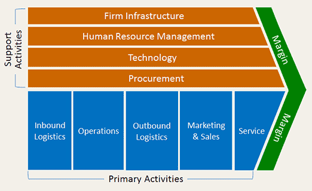
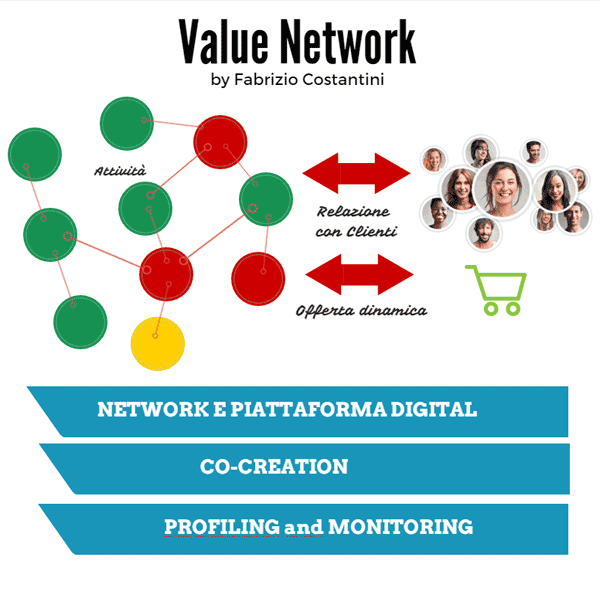
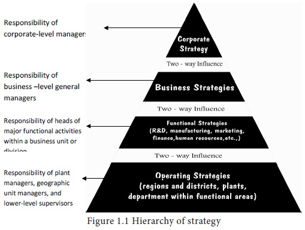
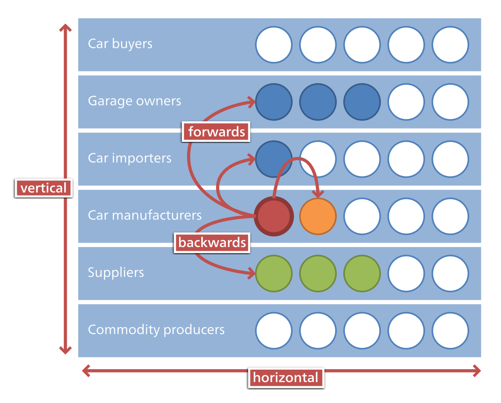
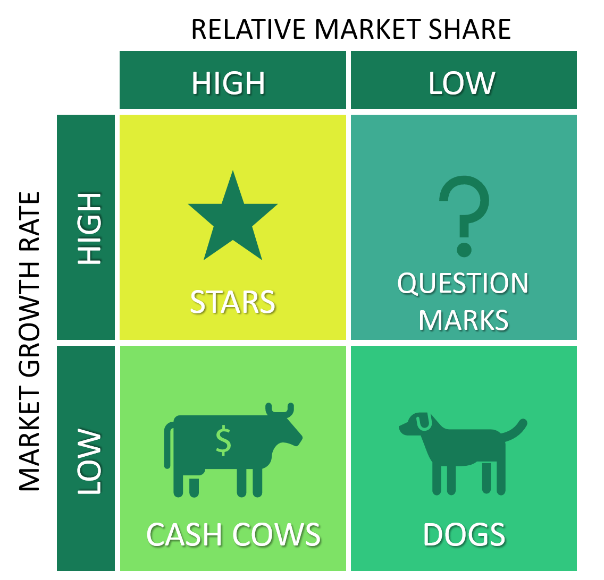
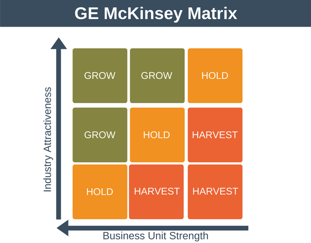
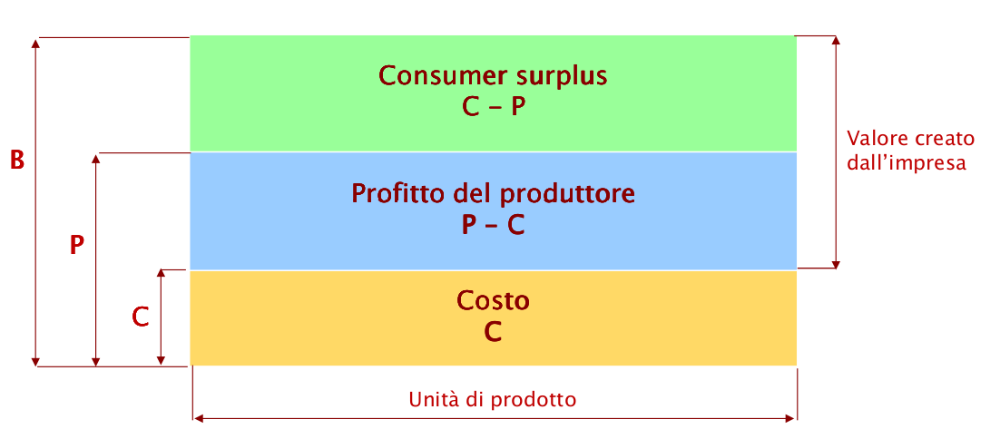
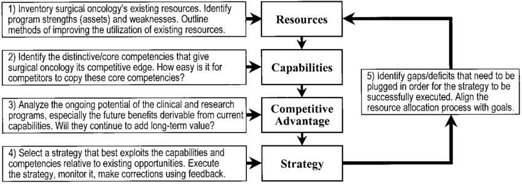

# Net economy

Il concetto di *net economy* è fortemente incentrato sulla digitalizzazione, la net economy è l' **"economia dell'informazione"**. I principali fattori che hanno portato da una tipo di economia tradizionale, basata principalmente sul *principio dei rendimenti decrescenti*, alla net economy, basata sul *principio dei rendimenti crescenti* , sono da ricercare in

* sviluppo e standardizzazione di internet come protocollo di comunicazione digitale.
* interconessione tra oggetti, persone e aziende.

L'utilizzo di internet permette di **ridurre i vincoli spaziali** nei rapporti economici, risultando inoltre un **nuovo canale distributivo** per le aziende. L'impatto di internet nelle attività delle aziende è massimo in quei settori in cui vengono prodotti e distribuiti **beni immateriali** . La capacità di raccogliere, elaborare e trasferire informazioni senza l''utilizzo di supporti fisici trasforma radicalmente i processi produttivi riducendo i costi di distribuzione.

##### Economia Tradizionale vs Net Economy

|                       | Economia Tradizionale           | Net Economy                         |
| --------------------- | ------------------------------- | ----------------------------------- |
| Mercati               | Stabili                         | Dinamici                            |
| Competizione          | Scala locale/nazionale          | Scala internazionale/globale        |
| Fattori di sviluppo   | Capitale, lavoro                | Innovazione e conoscenza            |
| Fattori di progresso  | Meccanizzazione e distribuzione | Informatizzazione                   |
| Vantaggio competitivo | Riduzione dei costi             | Innovazione, qualità e tempestività |

Nell'economia industriale (tradizionale), il **vantaggio competitivo** era detenuto da chi era in grado di **offrire prodotti di maggior qualità al minor costo**.  Poca enfasi veniva posta nei confronti del consumatore e delle sue necessità sopratutto in merito alla **personalizzazione dell'offerta** .

Nell'economia digitale il consumatore e i suoi bisogni assumono un ruolo centrale. La tecnologia permette di ottenere più informazioni riguardo le abitudini dei consumatori permettendo una **microsegmentazione del mercato** e **personalizzazione estrema dell'offerta**, realizzando prodotti di massa personalizzati (il che difficilmente poteva avvenire nell' economia industriale).

### E-commerce

<u>L'insieme dei processi e delle tecnologie con cui avvengono gli scambi commerciali su reti telematiche</u>. Tra le principali attività citiamo: compravendita di beni e servizi, fornitura di contenuti digitali, vendita diretta al consumatore e assistenza post-vendita, trasferimenti elettronici di fondi.

In base ai soggetti coinvolti nella transazione possiamo segmentare il merkato dell'e-commerce in attività:

* **Business-to-consumer (B2C)**: transazioni che intercorrono tra azienda e utente finale.
* **Business-to-business (B2B)**: transazioni che intercorrono esclusivamente tra aziende.

|                 | Vantaggi                                                     | Svantaggi                                                    |
| --------------- | ------------------------------------------------------------ | ------------------------------------------------------------ |
| **Venditori**   | **Riduzione dei costi fissi** (sede fisica e stoccaggio). Focus su  **attività di marketing **. | Ruolo marginale del venditore nel processo decisionale di acquisto. |
| **Consumatori** | **Facilità di acquisto** (tempo, energia, no vincoli orari). **Risparmio**(prezzi di vendita inferiori data la riduzione dei costi fissi) | Feedback diretto nell'acquisto.                              |

# Business Model

> Il  business model di un azienda è un modello che sintetizza, descrive e comunica le modalità con le quali l'azienda realizza la propria vision generando valore per gli stakeholders.

Risulta qui necessario distinguere due concetti correlati ma distinti:

* *Vision*: definisce gli obiettivi di lungo periodo dell'azienda considerando l'evoluzione del contesto operativo in cui essa opera.
* *Mission*: il motivo dell'esistenza dell'azienda sul mercato e l'obiettivo principale. Rappresenta inoltre un elemento distintivo che permette la differenziazione dai competitors.

## Teoria del valore: dalla value chain alla value network

Secondo la teoria del valore la finalità dell'impresa è la **creazione di valore**. Il concetto di valore assume connotazioni differenti:

* **Obiettivo di lungo termine che guida i processi decisionali e le scelte di management.**
* **Misura che rappresenta i risultati ottenuti dall'azienda** in base a varie dimensioni delle sue attività:
  * Economica, finanziaria, patrimoniale
  * Competitiva
  * Sociale
  * Intellettivo

##### Value Chain

Modello proposto da Micheal Porter, vede l'azienda come un processo che genera valore in modo **lineare**: partendo da una serie di input, ogni attività dell'azienda  (divise in *primarie* e di *supporto*) contribuisce alla **generazione del valore**, portando in output il prodotto/servizio da offrire al cliente. 

Durante il processo ogni componente consuma delle risorse (tempo, denaro, materiali, forza lavoro), attraverso il modello è possibile individuare  quali siano le **aree critiche che contribuiscono alla creazione o distruzione del valore**.

##### Value Network

Il modello della value chain pone il focus su costi ed efficienza, mentre **le attività ad alto contenuto informativo sono considerate di supporto**. In un economia digitale/ net economy dove le informazioni assumono un ruolo centrale, il modello proposto da Porter risulta limitato. 

Si passa dunque da un modello lineare ad uno con struttura a rete: la **Value Network**. La rete del valore consiste in un **insieme di agenti economici interconnessi  che co-creano il valore in modo collaborativo e sinergico.** Gli agenti in questione possono rappresentare aziende, clienti, fornitori di contenuti, fornitori di servizi commerciali e fornitori di infrastrutture.

In questo modello è possibile individuare i seguenti concetti chiave:

* **Attività** : sia interne svolte dall'azienda (attività core ed elementari) ma anche quelle esterne svolte da terze parti.
* **Network Logico** : rappresenta tutti gli agenti che offrono le loro competenze per la creazione del valore.
* **Network Fisico** : infrastruttura tecnologica che mette in comunicazione i vari agenti permettendo l'integrazione delle varie attività.
* **Co-creazione** : il valore viene creato sia internamente dall'azienda ma anche dagli attori esterni che diventano partner nella creazione di valore.
* **Profilazione e monitorazione**: le relazioni con i clienti sono uno dei fattori critici di successo. La capacità di segmentazione dei mercati, profilazione, monitorazione dell'esigenze ed esperienze dei clienti diventano attività fondamentali.

I modelli di business in un economia digitale sono sostanzialmente diversi da quelli adottati in un  contesto di economia tradizionale. I modelli di business digitali devono essere concepiti considerando non solo l'azienda ma anche le **reti di valore** all'interno delle quali essa si colloca.

Le aziende net based sono consapevoli del fatto che il vantaggio competitivo è molto meno difendibile rispetto al passato a causa della **potenziale concorrenza globale** e **rapido sviluppo tecnologico**, per mantenere il vantaggio competitivo e sopravvivere nel mercato si necessita di un **costante miglioramento e innovazione** con la capacità di **adattamento ai cambiamenti esogeni**.

## Fattori Critici di Successo

I Fattori Critici di Successo (FCS) consistono in un numero limitati di **aspetti gestionali** o “variabili" sulle quali il management può agire con le sue decisioni e che **possono incidere in modo consistente** (in negativo o positivo) sul **vantaggio competitivo** delle varie imprese del settore. Per un impresa net based gli FCS sono da ricercare principalmente in: 

* **Scalability del business model**:  il modello di business deve tener conto dell'abilità dell'azienda di far fronte ad na crescita della domanda di mercato, mantendeno i margini di profitto all'aumentare dei volumi di vendita.

* **Solution Branding** : il brand diventa per gli utenti l'insieme di aspettative rispetto ad un prodotto/servizio. Le attività di branding non devono essere orientate al prodotto ma guidate da un analisi delle esigenze degli utenti.

* **Vantaggio del first mover**: il vantaggio competitivo che un azienda accumula nei confronti dei competitors muovendosi prima nell'esercizio di una determinata attività. Un azienda first mover rafforza il suo brand sviluppando barriere all'entrata nei confronti dei potenziali competitors.

* **Value Bundling**: le imprese che oltre il core business aggiungono prodotti e servizi al proprio bundle hanno maggiori probabilità di successo.

  

# Strategie d'impresa

> Per strategia d'impresa s'intende un processo nel quale vengono pianificate decisioni commerciali, operative e finanziare considerando l'ambiente operativo e le risorse disponibili, al fine di raggiungere gli obbiettivi prefissati.

L'obiettivo principale della strategia consiste nella **creazione di valore** per gli stakeholders. Nella definizione di una strategia bisogna sempre considerare: la definizione degli obiettivi di **lungo periodo**, delle  nella **gestione** e nell' acquisizione e allocazione di risorse.

In prima analisi è utile differenziare le strategie in base al livello di business considerato:

> più alto andiamo più le azioni sono influenti sui livelli inferiori maggiore è l'orizzonte 

* **Livello Corporate**: strategia eleborata dai top manager per l'intera organizzazione. In una strategia corporate viene definito in quali business l'azienda vuole competere, quale **orientamento** dare alle strategie, quale struttura organizzativa deve assumere l'azienda. => *"Dove avviene la competizione?"*

* **Livello Business**: strategie rigurdanti le singole *Strategic Business Unit (SBU)* . Una SBU è la parte dell'organizzazione dotata di una **propria mission, mercato e competitors** e dunque di una propria strategia. In questo livello le stragie definiscono quali **vantaggi competitivi** costruire e come mantenerli, quali prodotti e servizi sviluppare e con quali criteri allocare le risorse. => *"Come avviene la competizione?"*
* **Livello Funzionale**: strategie rigurdanti le attività funzionali che compongono l'organizzazione aziendale. A differenza del livello superiore, questo tipo di strategie ha un raggio di azione più limitato sia rispetto all'orizzonte temporale che all'impatto sull'intera organizzazione.

Le strategia a livello corporate possono essere classificate in

* Strategie di **sviluppo**: concentrazione, diversificazione e internazionalizzazione.

* Strategie di **stabilità**: l'azienda **persegue la propria mission** e gli obiettivi senza un significativo cambio di strategie.
* Strategie di **contrazione**: l'azienda **riduce il suo campo d'azione**.

## Strategie di crescita 

#### Concentrazione

In una strategia di concentrazione l'azienda sceglie di concentrare le proprio risorse. 

Due differenti tipologie:

* **Integrazione Verticale** : l'azienda decide di espandersi lungo la filiera produttiva (*supply chain*) **internalizzando** le varie attività della filiera diverse da quelle svolte in origine. L'integrazione verticale permette all'azienda di rimanere nel settore di origine avendo **maggiore controllo sul ciclo produttivo**.

  I principali motivi che spingono ad un integrazione verticale sono la **saturazione del mercato**, la forte **specializzazione di risorse** umane e tecniche del settore e quando l'azienda si trova in presenza di un **forte potere di mercato dei fornitori** (pochi fornitori che impongo prezzi di acquisto alti) e quindi risulterebbe più conveniente produrre internamente. Tra le modalità più frequenti per realizzare forme di  integrazione verticale sicuramente citiamo **l'acquisto di un impresa** che già realizza una o più attività della filiera se questo conviene meno risorse economiche rispetto allo **sviluppo interno**.

  * | Vantaggi                                                     | Svantaggi                                                    |
    | :----------------------------------------------------------- | ------------------------------------------------------------ |
    | **Maggiore controllo** sulla filiera produttiva => si stabilizzando prezzi e qualità | Incremento della **complessità organizzativa**               |
    | Rafforzamento del **potere contrattuale** rispetto ai fornitori e clienti | Perdita di dinamicità rispetto alle **innovazioni tecnologiche** e difficoltà a prevedere la domanda |
    | **Stabilizzazione dei mercati** e dei volumi di produzione   |                                                              |

  > es. amazon nasce come piattaforma di ecommerce ma per ottenere la qualità del servizio desiderato integra verticalmente la logistica e la delivery con amazon logistics

* **Integrazione Orizzontale**: diametralmente opposta a quella verticale, prevede l'espansione dell'azienda nello **stesso stadio della filiera produttiva**. L'integrazione orizzontale favorisce l'espansione delle proprie attività in **<u>differenti aree geografiche e differenti mercati</u>** ottenendo **economie di scala**. Similmente all'integrazione verticale, anche in quella orizzontale, si ha u**n incremento della complessità organizzativa aziendale,** inoltre porta a **situazioni di monopoli**o di un determinato settore con interesse (negativo) da parte di organi governativi come l'antitrust.

  > acquisto di instagram e facebook

#### Diversificazione

Strategia di svluppo incentrata sull'acquisto di aziende che operano in **settori non correlati** rispetto a quelli di partenza. Al fine di attuare una strategia di diversificazione bisogna considerare il **potenziale di sviluppo** e **l'attrattività** dei settori in cui opera la nuova impresa senza sottovalutare l'incremento di risorse di management per le nuove attività.

Una strategia di diversificazione può realizzarsi principalmente in due modalità

* **Diversificazione Concentrica**: la diversificazione si articola attorno un **nucleo centrale** che costituisce un vantaggio rispetto ai competitors e attorno al quale si forma un indotto di attività complementari. Tale nucleo può essere rappresentato dalla **tecnologia dei processi produttivi** , **capacità organizzativa**, **rete di distribuzione**, **base di clienti**, **presenza in molteplici mercati**.

  > ws. dececco sughi e oli, 

* **Diversificazione Conglomerata**: si riuniscono imprese i cui prodott/servizi non sono in concorrenza tra loro e che appartengono a **settori completamenti non correlati**, l'unico legame tra le imprese è quello di far capo ad un unica ***holding*** che controlla il capitale investito.

  Tra le principali ragioni che spingono ad attuare una strategia di questo tipo citiamo:

  * la possibilità di affiancare imprese che hanno una forte disponibilità liquida ad imprese con bassa disponibilità ma alto potenziale.
  * compensazione di andamenti ciclici opposti di imprese differenti.
  * espansione in nuovi settori per ottenere maggiore redditività e potenziale sviluppo.
  
  > la holding samsung con samsung electronics e samsung heavy industries

## Fusioni ed Acquisizioni

Nella sezione precedente si è visto come le differenti strategie di sviluppo (vedi integrazione verticale o diversificazione conglomerata) solitamente prevedono l'acquisto di altre imprese. Solitamente si ricorre all'acquisto di altre imprese principalmente per:

* **Barriere all'ingresso in nuovo mercato** (controllo su fattori strategici, brevetti, licenze, marchi, customer loyalty)
* **L'acquisto richiede meno risorse rispetto allo sviluppo interno** di prodotti/servzi o rete di distribuzione

In un economia tradizione, le fusioni e le acquisizioni (M&A), erano la naturale conseguenza dei processi di consolidamento settoriale da parte dell'impresa. Con la net economy, le operazioni di M&A, sono il risultato d**i strategie di espansione dei mercati**, **completamento della catena del valore** nelle core activity e sfruttamento di sinergie (1+1 > 2).

Le operazioni di M&A portano alla creazione di *multinazionali*, imprese che controllano molteplici unità operative in differenti aree geografiche le cui strategie delle singole unità vengono ricondotte ad una comune strategia generale.

## Gestione del Business

In questa sezione verranno analizzati due modelli basati sulle *matrici di portafoglio*, utilizzati nelle strategie a livello di business.

##### Matrice BCG (Boston Consulting Group):

Modello nel quale si classificano le SBU in 4 categorie differenti, considerando due dimensioni: 

* **Tasso di crescita** del mercato (asse verticale) 
*  **Quota di mercato relativa** (asse orizzontale) .

Le 4 categorie di SBU sono:

* ***Stars***: SBU con posizione **competitiva alta e mercato in forte sviluppo.** Sono le SBU con maggiori **prospettive di profitto** e opportunità di sviluppo ma **necessitano di ingenti investimenti.**
* ***Question marks*** : SBU p**osizione competitiva debole ma in un mercato in forte sviluppo**. Necessitano di molta liquidità per ottenere la **leadership del mercato**.
* ***Cash Cows***: SBU con **posizione competitiva forte in un mercato con basso ritmo di sviluppo**. Sono in grado di **generare liquidità** e profitti da investire nelle SBU stars e necessitano di investimenti ridotti.
* ***Dogs*** : SBU con **posizione competitiva debole in un mercato con basso ritmo di sviluppo**. Non conviene investire data la mancanza di profitti futuri e prospettive di crescita.

##### Matrice McKinsey

A differenza della matrice BCG offre una visione più granulare delle strategie d'impresa e viene costruita su due dimensioni **posizione competititva** (quota di mercato relativa, reputazione, margini di profitto rispetto ai comeptitors, reputazione e immagine dell'impresa) e **attratività del settore** (dimensioni, tasso di crescita, redditività, grado di rischio e incertezza del mercato), variabili aggregate che sintetizzano diversi fattori.

# Vantaggi Competitivi

Con vantaggio competitivo s'intende tutto ciò che ad un impresa gli permette di avere una **redditività superiore alla media del settore**. 

Il concetto di redditività può essere quantificato da molteplici punti di vista attraverso l'utilizzo di diversi indici:

**Return On Asset (ROA):**
$$
\frac{\text{Margine Operativo Netto (MON)}}{\text{Totale Impieghi}}
$$

**Return On Sales (ROS):**
$$
\frac{\text{Margine Operativo Netto (MON)}}{\text{Ricavi}}
$$

**Return On Equity (ROE):**
$$
\frac{\text{Utile di esercizio}}{\text{Patrimonio Netto}}
$$

O in termini più qualitativi attraverso la **quota di mercato**, **customer satisfaction**, **customer loyalty**. Nella definizione di vantaggio competitivo intervengono i seguenti elementi:

* **Beneficio Percepito** (B): **somma dei benefici percepiti** dall'acquisto di un prodotto/servizio da parte di un cliente al netto dei costi di transazione (escluso il prezzo) e costi di installazione, esercizio o manutenzione.
* **Consumer Surplus**: differenza tra beneficio percepito e il suo prezzo monetario (P).
*  **Valore creato dall'impresa**: differenza tra beneficio percepito e costo del prodotto (C).

## Le fonti del vantaggio competitivo

Il vantaggio competitivo è influenzato da **cambiamenti *endogeni***, ovvero interni all'impresa', e dalla capacità dell'impresa di reagire e anticipare i **cambiamenti *esogeni***, esterni alla stessa. Analizziamo dunque quali sono le fonti che determinano il vantaggio competitivo di un impresa. 

Due framework di analisi principali:

* **Approccio Strutturale**: si basa sull'analisi della **posizione nel settore** dell'impresa rispetto ai competitors. Le fonti di vantaggio competitivo sono da ricercare principalmente in  **fattori esogeni**
* **Resource Based Theory**:  Pone il focus sulle **risorse interne** dell'impresa e sulla loro **importanza** in termini di **costruzione di vantaggio competitivo sostenibile**. Le fonti di vantaggio competitivo sono da ricercare principalmente in  **fattori endogeni**

##### Approccio Strutturale

Secondo l'approccio strutturale il vantaggio competitivo può essere costruito seguendo 3 strategie generiche:

* **Leadership di costo**:  la capacità dell'impresa di produrre prodotti/servizi simili o equivalenti rispetto a quelli dei competitors ad un **costo minore**. Al fine di minimizzare il costo di produzione l'azienda può **migliorare il processo produttivo**: migliore efficienza d'uso degli impianti e attrezzature, contenimento dei costi delle funzioni aziendali, minimizzazione dei costi minimi. Tale vantaggio competitivo è **"product-driven"** e si manifesta principalmente nei **confronti dei competitors.**
* **Differenziazione**: la capacità dell'impresa di produrre prodotti/servizi con **caratteristiche uniche** per il cliente che vengono percepiti superiori rispetto all'offerta della concorrenza.  La differenziazione può avvenire attraverso: il design, il brand, il servizio al clienti o la rete di distribuzione. Tale vantaggio competitivo è **"market-driven"** ed è **orientato principalmente al cliente.**

* **Focalizzazione**: l'impresa **concentra l'offerta** su uno o più segmenti di mercato invece che l'intero settore. La focalizzazione può avvenire a livello geografico, demografico o comportamentale. Tale strategia è **ortogonale** rispetto alle due precedenti, avendo dunque strategie di focalizzazione orientate al costo e alla differenziazione.

L'approccio strutturale risulta una **notevole semplificazione** della realtà, spesso le due strategie di leadership di costo e di differenziazione **non sono mutuamente esclusive** ma le imprese tendono a **perseguirle entrambe**.

##### Resource Based Theory

Questo framework individua il vantaggio competitivo nei **fattori endogeni** dell'impresa quali:

* **Risorse**: fattori produttivi, risorse umane, tecnologiche, finanziare e organizzative. 
  * **Le risorse *tangibili***: sono quelle che più si prestano ad essere imitate e direttamente confrontabili tra i competitors e sono: le economie di scala e scopo, i costi di pubblicità e promozione, la copertura geografica della rete distributiva, il costo delle materie prime, ecc... 
  * **Le risorse *intangibili***: sono più difficili da imitare in quanto in quanto **rare e complesse** da ottenere: conoscenza, capacità di innovazione, l'accesso alle informazione, la cultura aziendale, il brand, la customer loyalty, know-how di processi (produttivi, di gestione, tecnologici).
* **Capacità**: le capacità organizzative sono le capacità di **reperire** risorse, **aggregarle** e **coordinarle** nei processi produttivi  in modo superiori rispetto ai competitors.
* **Competenze distintive**:  **risorse + capacità**, ciò che l'impresa non ha in comune con i suoi competitirs.

La Resource-based theory afferma che le **risorse di valore, rare e difficili da imitare e sostituire, sono quelle che su cui può essere costruito un vantaggio competitivo sostenibile** in quanto risultano risorse strategiche. Al fine di risultare utili per la costruzione del vantaggio competitivo si richiede che le risorse presentino le seguenti caratteristiche:

* **Durabilità**: l'arco di vita di una risorsa dipenda dalla natura della stessa (es. risorsa tecnologica vs risorsa umana o il brand di un'impresa). Le capacità hanno una durabilità maggiore rispetto alle risorse in quanto è possibile mantenere le capacità internamente all'azienda sostituendo le risorse esaurite.
* **Trasparenza**: la capacità di mantenere il vantaggio competitivo dipende anche dalla velocità con cui i competitors riescono ad **imitare** le strategie dell'impresa. La difficoltà di imitazione è direttamente proporzionale alla complessità del sistema di risorse utilizzate dall'impresa da copiare.
* **Trasferibilità**: l'imitazione di una strategia prevede l'acquisizione delle risorse e lo sviluppo delle competenze su cui tale strategia è fondata. Maggiore è la trasferibilità di tali risorse minore sarà la durata del vantaggio competitivo acquisito.
* **Riproducibilità**: la capacità di sviluppare internamente le risorse e le capacità utilizzate in una strategia rivale.

Analisi nel framowork RBT: 

## Elementi del vantaggio competitivo

* efficienza: produttività in termini monetari, economie di sclaa
* qualità: se riesce a soddisfare il più possibile le esigenze del consumatore
* innovazione: incrementale o radicali che modificano le dinamiche di comepetizione. RIdurre *time to market*
* capacità di risposta ai clienti

# Comunicazione d'Impresa

La comunicazione d'impresa prevede una moltitudine di soggetti e aspetti coinvolti. Una prima categorizzazione della comunicazione d'impresa può essere effettuata considerando le diverse categorie di soggetti coinvolti:

| Tipologia                 | Soggetti                                                     | Oggetto della comunicazione                                  |
| ------------------------- | ------------------------------------------------------------ | ------------------------------------------------------------ |
| **Commerciale**           | soggetti esterni all'impresa quali i clienti                 | prodotto, servizio, brand                                    |
| **Economico-Finanziaria** | finanziatori, investitori e portatori di capitale            | situazione reddituale, patrimoniale e finanziare dell'impresa. |
| **Istituzionale**         | organismi pubblici, istituzioni e rappresentanze sociali     | ruolo dell'azienda nella comunità di appartenenza.           |
| **Interna**               | soggetti interni all'impresa quali i dipendenti, dirigenti e collaboratori | le attività, i processi, gli obiettivi dell'impresa.         |

Tra i principali strumenti di comunicazione citiamo :

* **Pubblicità**: comunicazione tra azienda ed un vasto pubblico non selezionato.
* **Promozione**: azioni finalizzate a  stimolare il cliente all'acquisto . Si realizzano spesso attraverso campagne promozionali di periodo limitato facendo leva sul prezzo.
* **Relazioni pubbliche**: iniziative come convegni, seminari, presentazioni, sponsorizzazioni finalizzate a stimolare una reputazione positiva dell'impresa.
* **Propaganda**: insieme eterogeneo di iniziate volte a rafforzare la notorietà del prodotto
* **Marketing diretto**: comunicazione tra azienda e singoli clienti  

##### Internet e Comunicazione

Internet diventa un nuovo mezzo di comunicazione che modifica i tradizionali modelli di comunicazione.

Si passa da un modello **one to many** della comunicazione di massa, in cui l'utente ha un **ruolo passivo** nella costruzione dei contenuti, alla possibilità simultanea  di due modelli **one to one** e **many to many**. Con Internet, gli utenti hanno un **ruolo attivo** avendo modo di **condividere** e **interagire** con i contenuti.

La costruzione di un sito web permette di collezionare molte informazioni, sia qualitative che metriche quantitative utili per formulare strategie di marketing. Attraverso l'utilizzo di differenti forme di acquisizione dell'informazione (form, questionari, email, navigazione sul sito, click stream analysis, sentiment analysis) è possibile analizzare il **customer behaviour** ed effettuare segmentazioni di mercato.

Tra le principali attività di comunicazione agevolate da Internet, citiamo il **direct marketing**: un strategia di comunicazione d'impresa rivolta ai **singoli clienti** accuratamente **selezionati** con lo scopo di ottenere una risposta da parte dei clienti **diretta, immediata e misurabile**. In questo modo l'azienda riesce ad ottenere un maggiore livello di **personalizzazione dell'offerta** riuscendo ad  anticipare le esigenze del cliente.

Il direct marketing si articola in 4 fasi principali:

1. Identificazione del target
2. Selezione dei media: radio, tv, stampa, internet, newsletter, eventi, ecc.
3. Definizione dell'offerta al fine di generare risposte e avviare un processo di fidelizzazione del cliente.

# Organizzazione Aziendale: 

##### Dalla collaborazione alla cooperazione

Il ruolo dell'innovazione dei processi aziendali assume un importanza strategica nella creazione del vantaggio competitivo. La capacità di innovazione deriva dall'attitudine dell'impresa alla **collaborazione**. Un trasferimento collaborativo di informazioni si verifica quando lo **scambio di conoscenza** (*esplicita* o *implicita*) avviene di  sulla base di 3 elementi:

* di **comune accordo**.

*  con uno **scopo comune**.
* in vista di **reciproci benefici**.

> La rete di imprese consente ai partecipanti di mettere in comune attività e risorse per migliorare il funzionamento aziendale e rafforzare il vantaggio competitivo.

A metà strada tra collaborazione e competizione troviamo la **cooperazione**, se la cooperazione avviene tra competitors allora si parla di **coopetizione**. Le relazioni dei rapporti di scambio modificano quelle pre-esistenti o creano nuove forme organizzative d'impresa:

* **strutture organizzative esterne**: su scala  inter-aziendale si vieen a formare un nuovo tipo di organizzazione: il  **network di imprese**. Il funzionamento della rete si fonda su un **principio di complementarietà** tra
  * **capacità interne** dell'impresa: fungono da moneta di scambio rappresentando le capacità dell'impresa di **contribuire**  e **beneficiare** alla cooperazione .
  * **collaborazione esterna**

* **strutture organizzative interne** : si passa da modelli prettamente **gerarchico-piramidali** a modelli **iperarchici**, dove ogni membro è **libero di comunicare** con chiunque altro eliminano la necessità di intemediari. => "flatten the hierarchy" **mantendo i ruoli** degli individui

## Rete di imprese

##### Fattori di Sviluppo

Una volta definiti gli elementi che caratterizzano il network di imprese, analizziamo ora quali sono i principali fattori che portano alla nascita e sviluppo di un organizzazione reticolare:

* **Incertezza della domanda**: domanda stabile con offerta incerta porta le imprese ad attuare strategie di *integrazione verticale*. In condizioni di incertezza di domanda le imprese cercano di aumentare la flessibilità organizzativa ricorrendo all'**outsourcing**.
* **Complessità delle attività**: la quantità di input per la produzione di un prodotto o l'erogazione di un servizio crea interdipendenza tra le attività favorendone il coordinamento.
* **Alta frequenza degli scambi**

In una  rete in cui <u>unità autonome interdipendenti che svolgono compiti complessi in presenza di domanda incerta</u>, il maggiore problema è la **coordinazione**. Piuttosto che affidare il controllo e la coordinazione ad *autorità* e *fonti di legittimazione legale* la rete si affida a **meccanismi sociali** **autoregolativi** quali:

* **Restrizione all'accesso**: riducendo il numero di partner negli scambi della rete si riducono inevitabilmente i costi della coordinazione. Inoltre aumentano  le interazioni tra i partners **consolidandosi** e permettendo lo sviluppo di *routine organizzative*.
* **Macrocultura**: uni sistema di valori condivisi da  luogo a **schemi di comportamento comuni** che favoriscono le attività di coordinazione. Gli eventi di settore, le riviste specializzate e la socializzazione tra gli appartenti agli ordini professionali sono fattori che permettono l'omogenizzazione, standardizzazione e la condivisione delle informazioni, comportamenti  e dei valori culturali.
* **Sanzioni Collettive**: punizione dei membri che violino le **norme e i valori del gruppo**. Questo meccanismo è essenziale in quanto definisce i **parametri di accettabilità** dei comportamenti dimostrando le **conseguenze** della violazione.
* **Reputazione**: al crescere dell'**incertezza** ambientale, le imprese della rete attribuiscono sempre maggiore importanza alla propria reputazione e quella dei partners. La reputazione riduce l'incertezza poiché **fornisce informazioni** sulla controparte dissuadendo da **comportamenti ingannevoli** principale freno degli scambi.

##### Tipologie della rete

A livello strutturale la rete di imprese può essere analizzata da differenti prospettive, ne riportiamo le principali:

* **Centralizzazione della rete**: descrive la **distribuzione delle risorse** condivise tra le imprese della rete. Indica il **grado di coinvolgimento** di un impresa nella rete. (in degree/centrality)
* **Interattività delle relazioni cooperative** : descrive la propensione ad **integrare le risorse** possedute all'interno della rete. (out degree)
* **Apertura dei blocchi strategici**: individua se sono presenti relazione cooperative **intra-blocco strategico e tra imprese di blocchi differenti** => le imprese di uno stesso blocco cooperano solo tra di loro o anche all'esterno? . Il grado di apertura è direttamente proporzionale al livello di incertezza della rete, in quanto le imprese sono spinte a ricerca nuove opportunità quindi ampliare le loro relazioni.
* **Densità dei blocchi strategici**: **distribuzioni delle relazioni cooperative all'interno del blocco**. La densità del blocco è indicatore della connessione e del coinvolgimento delle imprese all'interno del blocco.

> un blocco strategico è un insieme di imprese più densamente connesse rispetto ad altre (network community) 

In base alle caratteristiche strutturali presentate è possibile individuare 4 tipologie principali di reti:

| Nome             | Caratteristiche Strutturali                                  | Settore Tipico                                      |
| ---------------- | ------------------------------------------------------------ | --------------------------------------------------- |
| Reti Frammentate | assenza di leadership di mercato e relazioni cooperative con forte instabilità | IT                                                  |
| Reti Complesse   | Gerarchia tra blocchi, relazioni altamente interattive, molteplici percorsi relazionali | Biotecnologie (relazioni con più centri di ricerca) |
| Reti di Filiera  | Blocchi con bassissima apertura, rapporti stabili e di lungo termine | Automotive                                          |
| Reti Orizzontali | Centralizzata, densa, chiusa, a bassa intensità relazionale  |                                                     |

## Imprese Virtuali

La struttura reticolare si ripercuote anche sull'organizzazione aziendale **interna**. La nuova impresa risulta essere :

* **Frattale**: l'organizzazione interna è strutturata a rete.
* **Virtuale:** i soggetti interni si articolano in **team virtuali,** ridefinendosi in base alle condizioni di mercato. Un organizzazione virtuale tende a rendere **permeabili le barriere** tra livelli e funzioni organizzative al fine di rendere più **dinamico e flessibile il trasferimento** di informazioni, idee, competenze e decisioni. Le barriere possono essere: *verticali*, barriere tra gradi e livelli; *orizzontali*, barriere tra funzioni e discipline; *esterne*, barriere tra impresa e fornitori/clienti; *geografiche*, barriere tra aree geografiche, culturali e mercati.

* Basata su **teamworking**: gruppi di lavoro strutturati a rete con una struttura temporanea predisposti a **cambiamenti adattivi**. Il team è spesso composto da **individui eterogenei** e distribuiti geograficamente ma che **condividono interessi e obiettivi comuni**. 

  La predisposizione al cambiamento e la **volatilità** potrebbe risultare anche un potenziale problema in quanto non vengono a crearsi tra i membri quelle **relazioni sociali** utili ad ottenere un **alto commitment**.

  Affinché si crei un buon team si necessità la definizione di una **vision condivisa** e un ottimo livello di **comunicazione** supportato da una infrastruttura tecnologica.