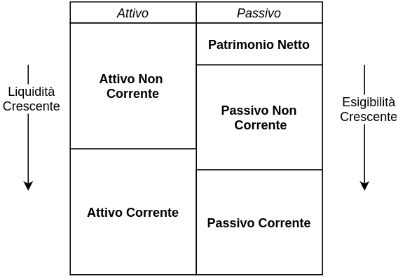
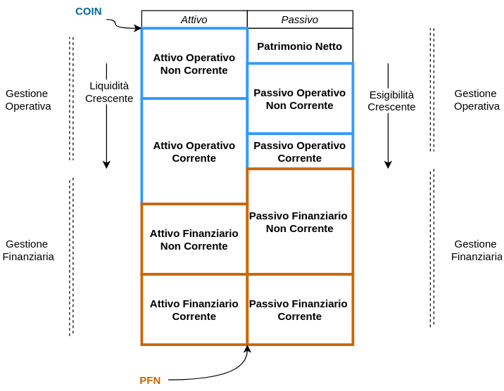
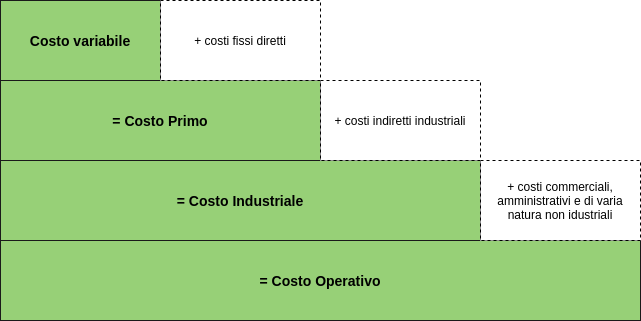
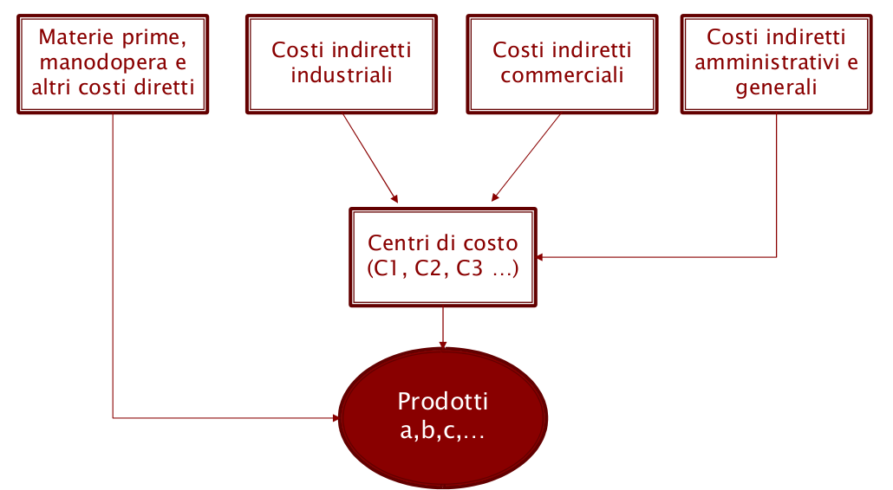

# Contabilità Generale
La contabilità generale è un sistema finalizzato alla rilevazione contabile degli aspetti gestionali:

* **Economici**: variazioni di ricchezza determinate da **realizzazione di ricavi** e **insorgere di costi**
* **Finanziari**: **entate e uscite** di denaro e **variazioni di crediti e debiti**

##### Il bilancio

* Cos'è? => insiemi di documenti finalizzati alla **rappresentazione veritiera e corretta degli aspetti economici-finanziari-patrimoniali derivanti da operazioni aziendali.**
* Finalità? => Rappresenta uno strumento di **controllo della gestione aziendale** e **comunicazione economico-finanziaria** verso gli stakeholders.

| Tipologia                         | Soggetti a cui è rivolto                  |
| --------------------------------- | ----------------------------------------- |
| Bilancio Civilistico              | Esterni (stakeholders e analisti)         |
| Bilancio Fiscale (normative TUIR) | Fisco                                     |
| Bilancio Interno                  | Interni (analisti interni, manager, soci) |

## Bilancio (Civilistico)

Lo strumento principale è il **bilancio**, un insieme di documenti articolati in:

* Stato Patrimoniale: attivo e passivo. Le voci nell'attivo vengonoclassificate in base al **criterio di destinazion eeconomica**, mentre il **passivo** per natura (tipologia del soggetto debitore)
* Conto Economico
* Nota Integrativa: documento che fornisce un commento esplicativo dei dati rappresentati nello stato patrimoniale e conto economico.

> Il bilancio viene redatto secondo la **IV direttiva CEE** che stabilisce la struttura dei documenti indicandone macroclassi, classi, voci e sottovoci.

### Stato Patrimoniale

Lo stato patrimoniale può essere considerato un **inventario complessivo di beni e diritti** vantati su questi beni. I beni sono considerati la parte dell'**attivo**, i diritti la parte del **passivo**.

| Attivo (criterio di destinazione economica) | Passivo (criterio per natura)   |
| ------------------------------------------- | ------------------------------- |
| A) Crediti vs. soci non ancora versati      | A) Patrimonio Netto             |
| B) Immobilizzazioni                         | B) Fondo per Rischi e Oneri     |
| C) Attivo Circolante                        | C) Trattamento di Fine Rapporto |
| D) Ratei e Risconti                         | D) Debiti                       |
|                                             | E) Ratei e Risconti             |

##### Attivo

* **A) Crediti vs soci per versamenti ancora dovuti**: crediti che l'azienda vanta verso i soci ma **non ancora incassati**. (es. sottoscrizione di una quota di capitale sociale non ancora versato dal socio)
* **B) Immobilizzazioni**: beni strumenti utili nella produzione destinati ad un **utilizzo durevole**. Sono divisi in
  * **I) Imm. Immateriali**: beni con natura intangibile (es. brevetti, licenze, software)
  * **II) Imm. Materiali**: beni con natura tangibile (es fabbricati, terreni, impianti industriali)
  * **III) Imm. Finanziarie**: es. titoli, crediti e partecipazioni in altre società
* **C) Attivo Circolante**: tutto ciò che **non è destinato ad un utilizzo durevole nel tempo**, tutte le componenti dello stato patrimoniale destinate ad essere "consumate" entro l'esercizio.
  * **I) Rimanenze:** rimanenze di produzione, da stoccare in magazzino e destinate alla vendita nel successivo esercizio
  * **II) Crediti vs clienti:** crediti che l'azienda vanta verso clienti o imprese controllate e collegate
  * **III) Attività finanziare che non costituiscono immobilizzazioni**: strumenti finanziari come titoli e  partecipazioni (BTP/BOT) in cui l'azienda investe per un eccesso di liquidità ma con l'intento di dismettere entro l'esercizio.
  * **IV) Disponibilità Liquide**: risorse immediatamente disponibili es. depositi bancari, assegni denaro e valori in cassa
* **D) Ratei e Risconti:** sono scritture di rettifica di operazioni di competenza di più esercizi, operazioni non concluse durante l'esercizio:
  * Ratei: ricavi /costi **maturati ma senza incasso/pagamento** perché la manifestazione avverrà in un esercizio futuro.
  * Risconti: ricavi/costi già incassati/sostenuti di competenza di esercizi futuri (es. fitto anticipato semestrale di un capannone aziendale) 

##### Passivo

* **A) Patrimonio Netto**: capitale dei soci.
* **B) Fondo per Rischi e Oneri**: fondo per coprire eventuali perdite future. fondi Rischi sono eventuali (es contestazione ) Oneri sono certi ma non si conosce l'ammontare (wa. manutenzione ciclica).
* **C) Trattamento di Fine Rapporto**: debito accumulato per la liquidazione del TFR nei confronti dei dipendenti.
* **D) Debiti**: debiti contratti dall'impresa, sia **debiti di finanziamento** debiti contratti soggetti come istituti di credito, obbligazionisti e finanziatori (muti, prestiti obbligazionari) il quale capitale deve essere  **restituito alle scadenze** concordate + il **pagamento di interessi** secondo le modalità stabilite. **Debiti di funzionamento**: debiti contratti dalle o**perazioni di compravendita** tra impresa e fornitori.
* **E) Ratei e Risconti**: speculare della macroclasse D) dell'attivo

### Conto Economico

Rendiconto sui 

* Ricavi (+)
* Costi (-)
* Imposte(-)

|                                                              |                                                              |
| ------------------------------------------------------------ | ------------------------------------------------------------ |
| A) Ricavi della produzione                                   | Ricavi relativi ai processi produttivi dell'azienda: ricavi dalle vendite e dalle prestazuibe, variazioni delle rimanenze di prodotti in corso di lavorazione, semilavorati e finiti, incrementi di immobilizzazioni per lavori interni |
| B) Costi della produzione                                    | Costi relativi ai processi produttivi dell'azienda: costi per materie prime e merci, per servizi, per il personale, per ammortamenti e svalutazioni, variazione delle rimanze, accantonamenti per rischi |
|                                                              |                                                              |
| A - B = **Reddito Operativo**                                |                                                              |
| C) Oneri e Proventi Finanziari                               | gestione delle attività finanziarie e dei finanziamenti      |
| D) Rettifiche di Valore di Attività e Passività Finanziarie  | rivalutazioni e svalutazioni realizzate sulle attività finanziarie detenute dall’impresa. |
|                                                              |                                                              |
| Reddito Operativo +- C +- D = **Reddito Ante Imposte**       |                                                              |
| Imposte sul Reddito di Esercizio                             |                                                              |
|                                                              |                                                              |
| Reddito Ante Imposte - Imposte sul reddito = **Utile/Perdita di Esercizio** |                                                              |
|                                                              |                                                              |

## Riclassificazione di Bilancio

Lo schema della IV direttiva CEE permette di ottenere un bilancio con uno schema **standardizzato e condiviso**. Lo schema però non rende agevole la lettura in tutti i casi. Si effettua quindi una **riclassificazione di bilancio**, che consiste essenzialmente in **ricombinare** le varie voci in nuove sezioni secondo **determinati criteri**.

### Riclassificazione Stato Patrimoniale

2 criteri principali:

* **Criterio Finanziaro**: utilizzato per mettere in evidenza la **solvibilità** dell'impresa, ovvero la capacità dell'impresa di far fronte alle **obbligazioni** assunte.
* **Criterio Funzionale**: utilizzato per mettere in evidenza la **solidità** dell'impresa, ovvero la capacità di **autofinaziarsi** ricorrendo esclusivamente a mezzi propri.

##### Criterio Finanziario

Le attività sono organizzate in funzione della "**rapidità di trasformazione in liquidità**", le passività in funzione del "**periodo di esigibilità**".

* **Attivo non Corrente**: tutte le attività (impieghi) destinati a **rimanere nel patrimonio azienda per un periodo superiore a quello di esercizio**  (es. immobilizzazioni).
* **Attivo Corrente**: tutte le attività legate al ciclo *acquisto-trasformazione-vendita* **destinate ad essere liquidate entro l'esercizio amministrativo** (es. crediti vs clienti, assets in vendita nell'esericizio).
* **Patrimonio netto**: capitale sociale, autofinanziamento dato dalla produzione, riserve.
* **Passivo non Corrente** e **Passivo corrente** analogo all'attivo (debiti finanziari e operativi, fondo rischi e oneri)

##### Criterio Funzionale

Le voci sono riorganizzate secondo il **criterio di pertinenza gestionale** :

* **Area Operativa** (o caratteristica): tutte le attività legate al core business.
* **Area Accessoria**: tutte le attività non strettamente legate al core business ma .
* **Area Finanziaria**: tutte le attività legate alla gestione finanziaria, ovvero il riperimento e impiego di capitale.

Il criterio funzionale permette di ottenere un **maggiore grado di granularità** rispetto a quello finanziario individuando una nuova dimensione:

La riclassificazione funzionale permette di calcolare due misure aggregate:

* **Capitale Operativo Investito Netto**: indica il **capitale investito** dall’impresa nella sua attività tipica al netto delle **passività relative alla attività caratteristica** dell’impresa. solo gestione operativa, al netto delle passività operative.
* **Posizione Finanziare Netta**: solo gestione finanziaria, al netto delle attività finanziare.

### Riclassificazione Conto Economico

La riclassificazione del conto economico consiste sopratutto nel **disaggregare** le voci relative ai costi di produzione e riclassificarle in base al **criterio di pertinenza gestionale**. Tre modelli principali di riclassificazione:

##### a Valore Aggiunto

I costi operativi vengono suddivisi tra **costi relativi a risorse interne**  (personale, attività, materiali e non, ecc.) e **costi relativi a risorse esterne** (materie prime, per servizi, ecc.).  La riclassificazione permette di mettere in evidenza una serie di **margini intermedi**:

* **Valore aggiunto**: differenza tra i ricavi operativi e costi operativi. Esprime la capacità dell'impresa di generare ricchezza per i vari soggetti coinvolti (finanziatori, personale, ecc.).

* **Margine Operativo Lordo (MOL)**: margine residuo dopo aver retribuito il personale.

* **Margine Operativo Netto (MON)**: margine depurato dai costi non monetari (ammortmenti e accontamenti)

* **Earns Before Taxes and Interests (EBIT)** : margine prima degli oneri finanziare e delle imposte.

  

##### a Costo del Venduto

I costi operativi vengono suddivisi tra **costi diretti ** e **costi Indiretti**

##### a Margine Contributivo

I costi operativi vengono suddivisi tra **costi fissi** e **costi variabili**. Il margine di contribuzione è il saldo tra                											**Ricavi netti di vendita** - **costi fissi** 

ed esprime la capacità dell’azienda di **integrare i costi con la variazione dei ricavi**.

> le ultime due modalità necessitano di informazione della contabilità analitica quali in primis la **struttura dei costi**.

## Analisi di Bilancio

Gli indici sono misure assolute dello stato dell'impresa, per essere interpretate e utili devono essere confrontate e contestualizzate sia nella dimensione temporale ( confronto con esercizi passati) sia spaziale (intesa come spazio economico, settore, mercato e competitors).

> es. un ROE = 100/1000 = 10% è un valore assoluto, per essere indicativo deve essere ad esempio confrontato con il ROE medio del settore.

##### Analisi di Liquidità

L'analisi di liquidità permette di analizzare la **capacità dell'azienda di far fronte agli impegni finanziari di breve termine utilizzando il capitale circolante.** Il calcolo di indici di liquidità è basato sulla **riclassificazione finanziaria** dello stato patrimoniale. I Tra i più importanti margini e indici citiamo:

* **Margine di Tesoreria e Indici di Liquidità**: esprime la capacità di far fronte alle passività correnti **senza considerare le rimanenze** (quindi solo con le disponibilità liquide).
  $$
  \text{Margine di Tesoreria} = \text{Attività Correnti} - (\text{Rimanenze} + \text{Passività Correnti})
  $$

  $$
  \text{Indice di Liquidità} = \frac{\text{Attività Correnti} - \text{Rimanenze}}{\text{Passività Correnti}}
  $$

* **Capitale Circolante Netto e Indice di Disponibilità**:  esprime la capacità di far fronte alle passività correnti **utilizzando tutti gli elementi dell'attivo circolante** ( I) Rimanenze, II) crediti vs clienti IV) dispon. liquide)
  $$
  \text{Capitale Circolante Netto} = \text{Attività Correnti} - \text{Passività Correnti}
  $$

  $$
  \text{Indice di Disponibilità} = \frac{\text{Attività Correnti}}{\text{Passività Correnti}}
  $$

  > Il CCN è un indice "più forte" del Margine di tesoreria, se il CCN < 0 significa che nemmeno con la cessione delle rimanenze si è in grado di estinguere i debiti operativi.

##### Analisi di Redditività

L'analisi di Redditività permette di analizzare la **capacità dell'azienda di generare risorse per remunerare i fattori produttivi impiegati nella gestione**. Il calcolo di indici di redditività è basato sulla **riclassificazione funzionale** dello stato patrimoniale e **riclassificazione a valore aggiunto** del conto economico. I principali indici di redditività sono:

* **Return on Equity (ROE)** : esprime la capacità dell'azienda a **remunerare il capitale proprio** (capitale apportato dai soci) => Quanto rende solo il capitale investito dai soci nell'impresa?
  $$
  \text{ROE} = \frac{\text{Utile di Esercizio}}{\text{Patrimonio Netto}}
  $$
  
* **Return on Investiments (ROI)** : esprime la capacità dell'azienda a **remunerare il capitale totale investito** => Quanto rende tutto il capitale investito nell'impresa?
  $$
  \text{ROI} = \frac{\text{Reddito Operativo}}{\text{Capitale Investito Netto}}
  $$

  Dove il reddito operativo è il saldo A)-B) della gestione caratteristica (vedi conto economico) e il capitale investito netto rappresenta tutto ciò che è stato investito a livello finanziario (patrimonio netto + ammortamenti ) al netto delle disponibilità liquide.

* **Return on Debt (ROD)**: esprime la capacità dell'impresa a **remunerare il capitale di terzi**:
  $$
  \text{ROD} = \frac{\text{Oneri Finanziari}}{\text{Debiti Finanziari}}
  $$
* **Return on Sales (ROS)**: esprime la **redditività delle vendite**,  ovvero quanto dei ricavi non viene assorbito dalla gestione operativa.
  $$
  \text{ROS} = \frac{\text{Reddito Operativo}}{\text{Ricavi delle Vendite}}
  $$
  

##### Analisi di Solidità

L'analisi della Solidità permette di analizzare **la struttura e la correlazione tra fonti e impieghi**.

A livello di composizione di impieghi individuiamo  i seguenti indici principali:

* **Rigidità ed Elasticità degli impieghi** rappresentano la capacità dell'azienda a far fronte ad un **bisogno di liquidità imprevisto**:

$$
\text{Rigidità degli Impieghi} = \frac{\text{Attività Non Correnti}}{\text{Totale Impieghi}} \qquad \text{Elasticità degli Impieghi} = \frac{\text{Attività Correnti}}{\text{Totale Impieghi}} 
$$

* **Indice di indebitamento**: esprime il rapporto tra i mezzi terzi finanziari e i mezzi propri finanziari, permettendo di valutare **l'indipendenza dai finanziatori esterni**:

  $$
  \text{Debt}/\text{Equity} = \frac{\text{Posizione Finanziare Netta}}{\text{Patrimonio Netto}}
  $$

  > se D/E = 2 questo significa che per ogni unità di moneta apportata dai soci, i finanziatori ne apportano 2

* **correlazione fonti impieghi** : l'equilibrio della stuttura finanziara è dato dal fatto che impieghi correnti devono essere correlati a fonti correnti, e impeghi non correntie fonti non correnti

# Contabilità Analitica

concetti principali su cui si basa la contabilità analitica:

* **Oggetto di Costo**:  gli oggetti del sistema aziendale dei quali vogliamo determinare il valore (prodotti, clienti, reparti, processi)
* **Costo**: il valore, in termini monetari, delle risorse che l'oggetto di costo assorbe.

Alcuni aspetti che differenziano la contabilità analitica da quella generale:

* la contabilità analitica è **libera dai vincoli di legge**, si possono scegliere differenti metodologie avendo maggiore libertà nell'esercitarle.
* Le informazioni considerate dalla contabilità analitica **sono esclusivamente quelle inerenti alla gestione caratteristica**, informazioni sia di carattere **consuntivo** che **preventivo**.
* Nella contabilità generale le voci di costo vengono classificate in base alla natura, nella contabilità analitica oltre che  per natura vengono utilizzati altri criteri

## Classificazione dei Costi

I c**osti sono meno soggetti a variabili esogene**, risultando maggiormente controllabili dai processi decisionali aziendali. Per questo motivo, analizzare la struttura dei costi risulta un'attività fondamentale. Esistono diversi criteri/modalità su come effettuare la classificazione:

* **Modalità di Assegnazione agli Oggetti di Costo**: 

  * **costi diretti** costi necessari alla realizzazione del **singolo** oggetto di costo. 

  * **costi indiretti**: costi necessari alla realizzazione  di **molteplici** oggetti di costo considerato. Non esiste una relazione 1-1 tra oggetto e costo, **non è possibile imputare oggettivamente** il costo all'oggetto di costo.

    > es. costo di ammortamento è indiretto se l'oggetto di costo è il singolo prodotto 

* **Comportamento dei costi al variare di un driver di riferimento**: possibili driver sono i volumi di produzione, n° di ordini processati, n° di clienti, ecc. Bisogna far attenzione al contesto, alcuni costi fissi possono diventare variabili in base all'orizzonte temporale considerato.

  * **Costi variabili**: costi che **variano in modo proporzionale** (costo = costo unitati x volume) al variare dei volumi di attività.

  * **Costi fissi**: costi che **non variano** al variare dei volumi di attività.

  * **Costi semi-variabili**: costi che hanno una componente fissa ed una variabile.

  * **Costi variabili a scalini**: costi che **rimangono costanti fino ad un certo livello** di volume per poi incrementarsi.

    > es. di costi variabili: acquisto di materie prime per la produzione, costi fissi: costi legati alla manodopera, costi a scalini: ammortamenti e noleggio di nuovi impianti, assunzione di nuovo personale. 

* **In funzione della controllabilità**:

  * **Costi controllabili**: costi il cui ammontare **è direttamente influenzabile** dalle decisioni di management.

  * **Costi non controllabili**: costi il cui ammontare **non è direttamente influenzabile** dalle decisioni di management.

    > es. un manager può direttamente agire su varie leve per influenzare il numero delle ore necessarie per la produzione, ma non può agire sul livello salariale.

  

  
## Costo del Prodotto

  La configurazione del costo dei prodotti è una componente essenziale per determinare il **prezzo di vendita**. Strategia di **stratificazione**:

  

L'imputazione dei costi diretti all'oggetto di costo , in questo caso il prodotto, avviene in maniera lineare (proprio per la definizione di costi diretti), altrettanto non è possibile per l'imputazione dei costi indiretti. L'imputazione del costo del prodotto dovrebbe seguire il **principio causale**:

> un costo viene attributo all'oggetto di costo in misura in cui tale oggetto ha determinato il sostentamento del costo (principio causa-effetto)

A questo proposito è possibile seguire 3 metodologie:

* **Contabilità semplificata**: il costo del prodotto viene calcolato senza imputare le voci di costo ad **oggetti di costo intermedi**. Questa metodologia porta a risultati poco attendibili in quanto non viene applicato il principio causale.

* **Contabilità per centri di costo**: la logica è quella di **aggregare i costi indiretti**, rispetto all’oggetto di costo finale, in **raggruppamenti intermedi** **(i centri di costo)** in modo da determinare con una migliore approssimazione il consumo di risorse da parte degli oggetti di costo finali. I centri di costo tipicamente coincidono con le **unità della struttura aziendale** (reparti, uffici, ecc.). Tale metodologia permette di applicare il principio causale in modo più consistente.

   

* **Activity Based Costing**:  la logica è quella di **aggregare i costi indiretti**, rispetto all’oggetto di costo finale, in base alle **attività che li generano**. Tale metodologia permette di applicare il principio causale in modo più consistente.

  