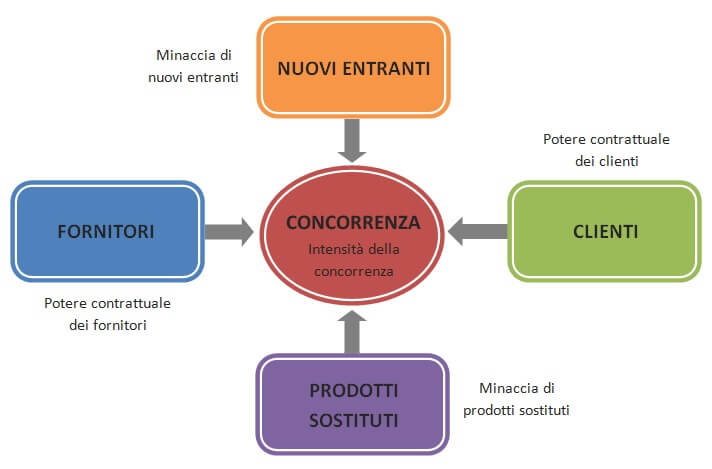
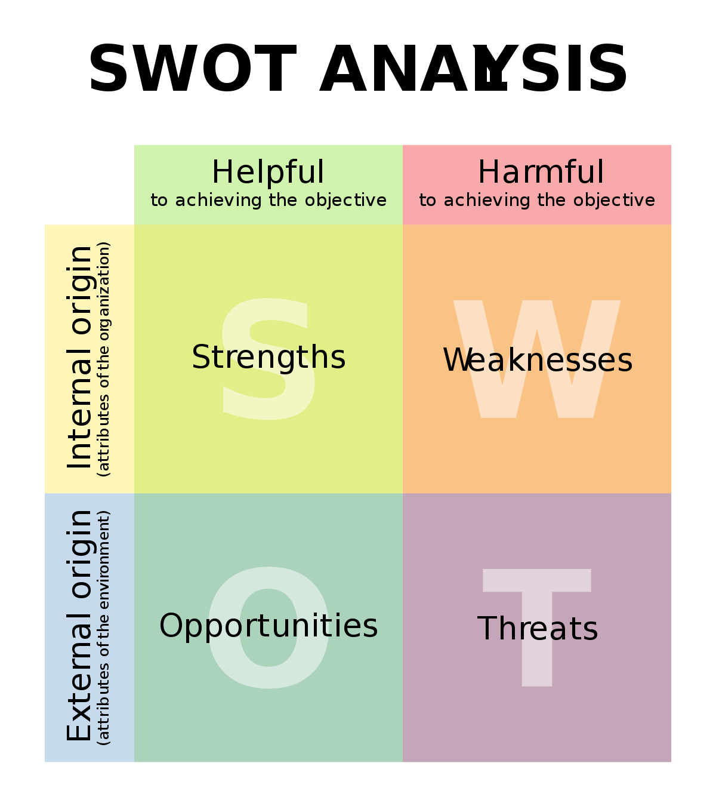
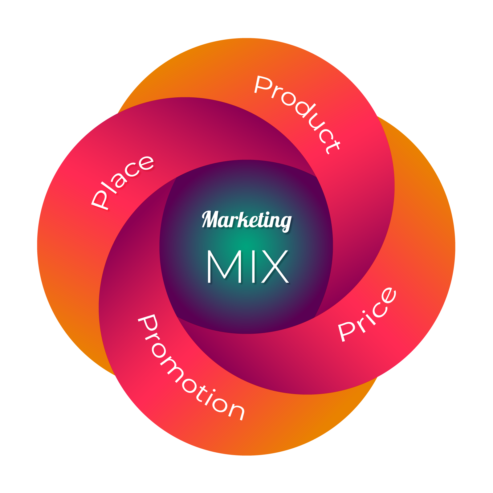
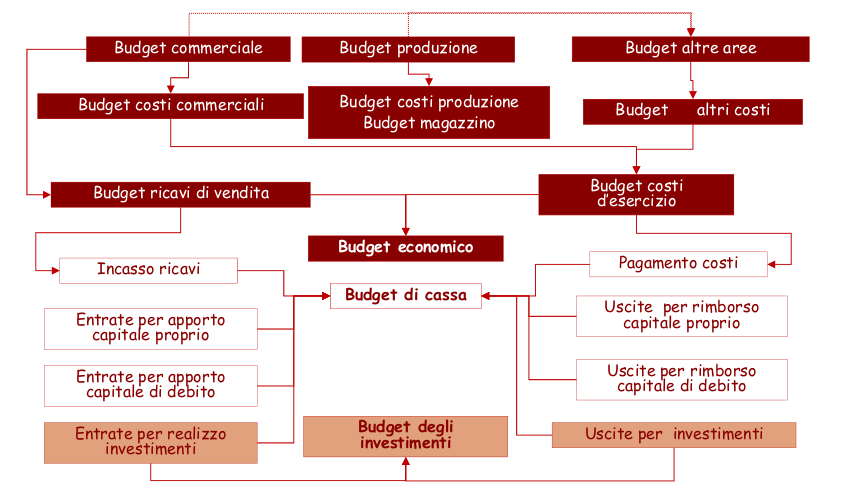
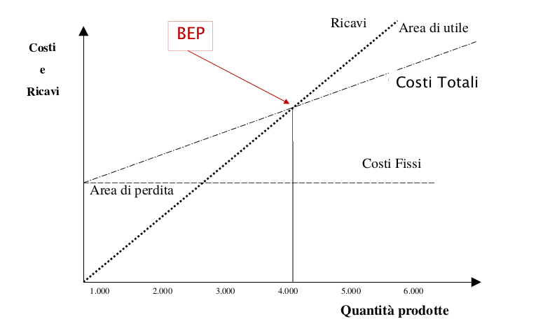

# Business Plan

> il business plan aiuta a formalizzare e comunicare l'idea imprenditoriale, passando dalla business idea iniziale in formula imprenditoriale finale. 

Strumento che  ha per oggetto uno specifico business su un orizzonte temporale di medio periodo. A differenza di altri documenti (es. il bilancio) non si mette a punto in determinati periodi ma esclusivamente quando serve

Il business plan ha due funzioni:

* **Interna**: finalizzata a **valutare le potenzialità** di un **progetto d'investimento**, supportare la gestione del business, implementare il **piano operativo d'impresa**, valutare la **sostenibilità economica e finanziaria** dell'impresa.
* **Esterna**: **comunicare** con gli stakeholders e **ottenere risorse**

Il business plan è un documento di suppoorto a:

* valutazione di nuovi progetti
* determinazione del valore economico d'azienda

### Area Strategica

* Analisi interna dell'impresa
  * Storia dell'impresa, 
  * governance (stato attuale ed evoluzione)
  * competenze maturate
  * core business
  * Partecipanti all'iniziativa (solo per startup)
  * Stadio di avanzamento delle attività (solo per startup)
* Analisi di mercato
  * A**ssociazione prodotti/servizi al target di clientela**
  * **Segmentazioni della domanda** (basata su aree geografiche, variabili demografiche, socio-economiche e psicografiche)

* Analisi di Scenario: si analizzano quali sono i possibili **scenari futuri** e quali sono le **ripercussioni** nel business date da possibili **cambiamenti**. 
* Strategie aziendali: 

###### Analisi di scenario: Modello delle 5 forze di Porter

Il modello delle 5 forze di Porter offre un framework per analizzare il **contesto competitivo** in cui l'impresa si trova ad operare ed aiutare ad **identificare le strategie**.

Il modello individua 5 forze che agiscono sul contesto competitivo. Ogni forza può agire sia a favore che contro il profitto dell'impresa. 

* **Potenziali nuovi concorrenti**: la facilità di entrata di nuovi concorrenti nel mercato può indebolire la posizione attuale dell'impresa. Per proteggere il vantaggio competitivo possono essere imposte **barriere all'entrata**: economie di scala, accesso alle tecnologie, switching costs, accesso alla distribuzione, ecc...
* **Compratori** : il livello di **potere contrattuale** dei compratori. Un alto livello può verificarsi nelle seguenti condizioni:
  * Pochi compratori con grandi quantità di acquisto.
  * Poca diversificazione dei prodotti/servizi da parte dell'impresa.
  * Switching cost bassi .
* **Fornitori**: il livello di **potere contrattuale** dei fornitori. I fornitori sono in posizione di forza nelle seguenti condizioni:
  * Pochi fornitori in un settore con molti compratori (Oligopolio)
  * I prodotti offerti dai fornitori non ha prodotti sostitutivi.
* **Prodotti sostitutivi** : la minaccia competitiva rappresentata dai prodotti sostitutivi è forte in presenza delle seguenti condizioni:
  * L'esistenza di prodotti sostitutivi facilmente ottenibili **pone un tetto massimo ai prezzi** applicabili ai prodotti nel settore.
  * Se è possibile c**onfrontare facilmente la qualità** e le prestazioni offerte dai prodotti sostitutivi
* **Intensità della concorrenza**: l'intensità della concorrenza dipende da
  * numero e dimensione dei concorrenti
  * ritmo di sviluppo del settore
  * caratteristiche dei prodotti/servizi
  * struttura dei costi
  * barriere all'uscita

##### Analisi SWOT

Strumento che aiuta nella pianificazione strategica

Si individuano 4 concetti:

* **Strengths** : **risorse** e **capacità** interne all'impresa sulle quali è possibile costruire vantaggi competiivi sostenibili. Sono i **punti di forza** che l'impresa fa meglio di altre.
* **Weakness**: risorse e **capacità** interne all'impresa **carenti** che impedisco di costruire vantaggi competitivi.  Sono i **punti di debolezza** che l'impresa fa peggio di altre.
* **Opportunities**: **tendenze positive** dell'ambiente esterno che possono contribuire al **miglioramento** dell'impresa.
* **Threats**: **tendenze negative** dell'ambiente esterno che posso contribuire al **peggioramento** dell'impresa

# Piani Operativi

### Il Piano di Marketing

Il piano di marketing contiene una o più **strategie di marketing** utilizzate nel raggiungimento degli obiettivi. Un piano di marketing, generalmente, ha le seguenti finalità:

* **Formalizzare gli obiettivi** di marketing
* **Verificare la coerenza** delle strategie di marketing con quelle complessive aziendali.
* **Definire le leve di marketing** mix (es. McCarty's 4P model: product, price , promotion, place)
* **Definire il piano di vendite** basandosi su dati storici (interni o di settore) o previsionali (indagini di mercato, consulenze di manager ed esperti di settore)

 Modello delle 4P:

* **Prodotto**: vengono definite le caratteristiche di un prodotto/servizio. Le caratteristiche possono essere definite su differenti livelli: **elementi soglia**, caratterizzano le funzionalità minime del prodotto; **elementi di posizionamento**, caratteristiche che servono a differenziare l'offerta e distinguersi dai competitors; **elementi di unicità**, caratteristiche che rendono il prodotto unico e consento di ottenere vantaggio competitvo
* **Prezzo**: vengono definite le politiche o modelli di pricing tenendo in considerazione:
  * A livello di prodotto: **l'elasticità/rigidità della domanda,** ovvero quanto è "sensibile" la domanda al variare dei prezzi. Percezione della componente prezzo
  * A livello di azienda: **struttura dei costi** e **piano delle vendite** 

* **Promozione**: viene definita la gestione della politica complessiva di comunicazione. Si definiscono: 
  * gli  **strumenti** da utilizzare_ pubblicità, marketing diretto e indiretto, forme di promozione, merchandising.
  * quali sono i **destinatari**: acquirenti attuali, acquirenti potenziali, influenzatori.
* **Canali di distribuzione** (place): viene definito il canale distributivo icoerentemente al target e la gestione commerciale in base a
  * Analisi costi/benefici.
  * Caratteristiche del prodotto.
  * Caratteristiche del mercato.
  * Strategia delle altre leve di marketing-mix .

### Il Piano Operativo

Nel piano operativo vengono presentati nel dettaglio gli **step necessari ad attuare le varie strategie d'impresa**. Il piano operativo deve basarsi sia il contesto operativo al tempo di redazione del business plan ma deve anche <u>prevederne la possibile evoluzione futura</u>. Nel piano operativo vengono effettuate scelte di 

* **Produzione** :
  * descrizione del **processo produttivo** adottato con le relative caratteristiche in termini di **benefici, rischi e complessità.**
  * meccanismi di **controllo qualitativo**
  * le risorse legate alla produzione (es. i macchinari)
* **Logistica**:
  * **movimentazione**: mezzi impiegati nel trasporto, risorse umane, flussi informativi, ecc.
  * **magazzino**: locali fisici, capacità residue, ecc.
  * **distribuzione**: scelta dei canali distributivi

### L'organizzazione e la Struttura Aziendale

Nella sezione vengono illustrati:

* il **management della società**
* **l'organigramma**: definendo ruoli e responsabilità
* il **piano di motivazione**, descrivendo l'impatto della cultura aziendale rispetto ai bisogni e aspettative del personale interno e dei collaboratori esterni.

Inoltre nella  **struttura aziendale** viene riportata:

* la **forma giuridica** e gli accordi con i soci considerando gli aspetti **legali, amministrativi e fiscali**.
* **Accordi esterni**: joint venture, accordi commerciali
* **Licenze**, **concessioni** ed **autorizzazioni**.

# Pianificazione Economico-Finanziaria

## Pianificazione Economica

Il **bilancio previsionale** permette di effettuare un'analisi **"what if?**" effettuando simulazioni di **differenti scenari**  simulando  come le variabili economico-finanziare **impattano sul business** e cosa succede al loro variare, prevedere i break points e gli eventuali piani di emergenza.

Il modello risultante deve essere **flessibile** ed in grado di **adattarsi** alle **variazioni delle assunzioni** fatte alla base del modello stesso. Possibili **errori** nell'effettuare le previsione: **concettuali, grado di dettaglio e di stima.**

Nella sezione vengono riportati:

* **Conto economico prospettico**

* **Stato patrimoniale prospettico**

* **Cash flow prospettico**: analisi previsionale dei flussi di cassa in entrata e uscita

* **Indici di performance**:

  * indicatori di liquidità:
    $$
    \text{Indice di liquidità} = \frac{\text{Attività correnti - Rimanenze}}{\text{Passività correnti}}
    $$

  $$
  \text{Indice di disponibiltà} = \frac{\text{Attività correnti}}{\text{Passività correnti}}
  $$

  * Indicatori di indebitamento:
    $$
    \text{Indice di autonomia finanziaria} = \frac{\text{Patrimonio Netto}}{\text{Totale Fonti}}
    $$

    $$
    \text{debt equity ratio} = \frac{\text{Posizione finanziaria netta}}{\text{Patrimonio Netto}}
    $$

  * Indicatori di redditività:
    $$
    \text{ROI} = \frac{\text{EBIT}}{\text{Capitale Netto Investito}}
    $$

    $$
    \text{ROE} = \frac{\text{Utile d'esercizio}}{\text{Patrimonio Netto}}
    $$

    

* **Analisi di sensitività e break even point**

> risulta fondamentale che le stime  effettuate nelle varie analisi previsionali siano condivise dalle differenti aree aziendali

##### Budget 

Dal conto economico prospettico, stato patrimoniale prospettico e cash flow prospettico viene definito il **budget**. Da un punto di vista strategico il budget:

* Stabilisce le **azioni da intraprendere** al fine di raggiungere gli obiettivi pianificati.
* Deve essere articolato per sub-sistemi in quanto deve rappresentare un **punto di riferimento quantitativo per i singoli manager**  nel raggiungimento di prestazioni efficaci ed efficienti (es. raggiungimento di un certo volume di vendite o contenimento dei costi).
* Deve essere caratterizzato da **margini di flessibilità** in relazione ai cambiamenti che posso verificarsi durante il periodo considerato.

##### 6Break Even Point e Sensitivity Analysis

Il break even point (BEP) è un valore che indica  la quantità di un prodotto venduto (in volumi di produzione o fatturato) necessaria a coprire i costi sostenuti. **Il BEP è il punto in cui costi totali e ricavi coincidono**:
$$
Q^* = \frac{\text{CFT}}{\text{PU}-\text{CVU}}
$$
Dove CFT sono i costi fissi totali, PU il prezzo di vendita unitario e CVU il costo variabile unitario per prodotto.

La determinazione del BEP è strettamente correlata alla tecnica della sensitivity analysis. Questo tipo di analis permette di **inidividuare le variabili critiche alle performance reddituale o finanziare analizzando vari scenari economici.** La sensitivity analysis permette di valutare la s**ensibilità del business** al variare degli scenari e quindi **verificare l'attendibilità dei risultati**

## Pianficazione Finanziaria

##### Valore Attuale Netto (VAN)

Permette di **valutare un iniziativa d'investimento** da un punto di vista economico-finanziario tenendo conto che l'investitore deve essere remunerato. Valore si riferisce ai flussi di cassa attesi (in e out), attualizzati all'anno corrente, al netto dell'investimento iniziale.
$$
\text{VAN} = - C + \sum_n \frac{\text{flusso}_n}{(1+i)^n}
$$

Dove $C$ è il **costo iniziale dell'investimento**, $i$ **tasso di rendimento per l'attualizzazione dei flussi**. Il fattore di attualizzazione serve per valutare il cambiamento del valore dell'investimento nel tempo, che generalmente diminuisce più passa il tempo. **Se $\text{VAN} > 0$ allora l'investimento è profittevole**. Sulla base del VAN è possibile definire il Profitability Index:
$$
\text{PI} = \frac{\sum_n \frac{\text{flusso}_n}{(1+i)^n}}{C}
$$
A differenza del VAN il PI permette:

* di **confrontare diverse idee imprenditoriali** per capire qual'è la più profittevole.
* di capire quale idea imprenditoriale **richiede meno investimento iniziale** (Il PI più elevato è quello con l'investimento iniziale più basso)

##### Discounted Cash Flow (DCF)

Metodo alternativo utilizzato per stimare il valore economico-finanziario dl un iniziativa d'investimento.
$$
\text{DCF} = \sum_n \frac{\text{flusso}_n}{(1+i)^n} + \frac{\text{TV}}{(i+1)^n}
$$
Dove TV è il **terminal value**, ovvero il valore residuo alla fine del periodo considerato. La metodologia si basa sullo stimare i flussi, la $i$ e il TV, e si articola nei seguenti steps:

1. **Prevedere i flussi di cassa disponibili**: definire quali sono le componenti dei cash flow => come? => sviluppando ipotesi e definendo possibili scenari futuri (come cresce il mercato? come la nostra quota di mercato? Quali saranno i nostri investimenti? Quale la strutture di costo?

2. **Stimare il tasso di sconto**: bisogna stimare il costo del capitale, questo dipende essenzialmente dal:

* **stima del costo del debito**: finanziamenti di terzi (istituti di credito o finanziatori) che costituiscono **capitale di debito** (su cui vengono riconosciuti gli interessi). Quali sono i tassi di interesse da riconoscere ai finanziatori? ($K_D$)
* **stima del costo dell'equity** : il patrimonio netto, il capitale che i soci investono a **titolo di rischio**. Quanto vale la remunerazione che i soci si aspettano? ($K_E$)
* **stima del rapporto tra debito ed equity**: si analizza la **struttura del capitale**, ovvero quanto dei miei finanziamenti sono di debito e quanti di equity? Qual'è il rapporto? (80-20, 50-50, ...) ($\frac{D}{E+D}$ e $\frac{E}{E+D}$)

Il tasso di rendimento $i$ può essere stimato utilizzando il **Weighted Average Cost of Capital (WACC)**:
$$
\text{WACC} = \overbrace{K_E \cdot \frac{E}{E+D}}^{\text{equity}} + 
\overbrace{K_D \cdot \frac{D}{E+D} \cdot (1-\text{aliquota fiscale})}^{\text{debito}}
$$

$$
K_E = \overbrace{R_{free}}^{\text{tasso rendimento risk free}} + \underbrace{\beta \cdot \overbrace{(R_{market} - R_{free})}^{\text{premio per rischio azionario}}}_{\text{rischio sistematico dell'azienda}}
$$

> il capitale di rischio (equity), da un punto di vista aziendale è più costoso. Questo perchè essendo di rischio è **attesa una remunerazione più alta**. Al contrario, l'aumento della dipendenza da capitale di debito aumenta la **possibilità d'insolvenza dell'impresa.** La struttura finanziare viene decisa sulla base di queste considerazioni.

3. **Stimare il terminal value**: decidendo **l'orizzonte temporale** della previsione ed il **tasso di crescita**.

4. **Calcolare ed Interpretare i risultati**: utilizzando anche la sensitivity analysis per analizzare le variabili critiche.